# 01 软件下载、授权与安装

## 下载

首先，在Avid官网上点击右上角**登录**，跟随提示完成账号注册并登录。

- Avid官网地址：https://www.avid.com/zh/

注意此处注册的是Avid主账户（Avid Master Account），后续需要可以将Avid主账户与Avid视频社区的账户链接，从而方便使用。（有**教育邮箱**的同学建议用教育邮箱注册，后文会提到）

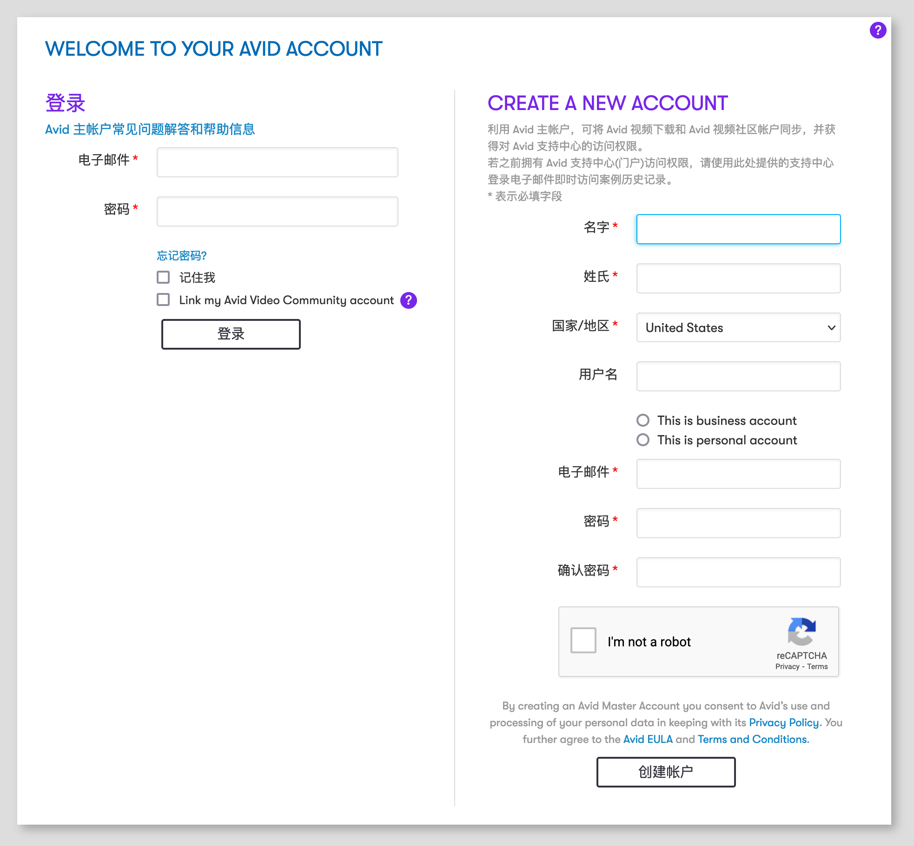

进入账户界面之后点击Avid Download Center，在产品列表中找到Avid Media Composer。

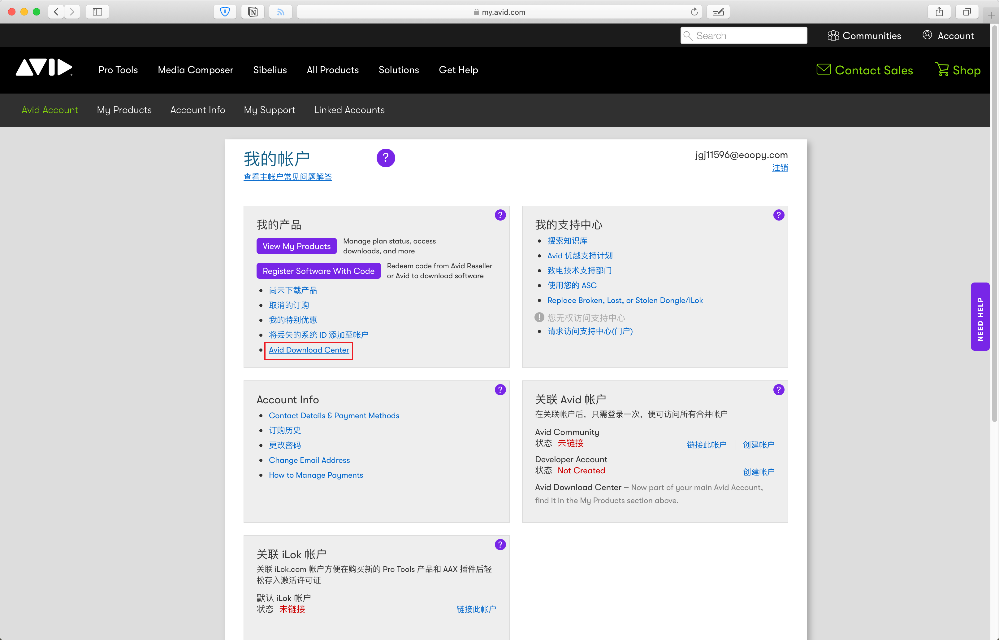

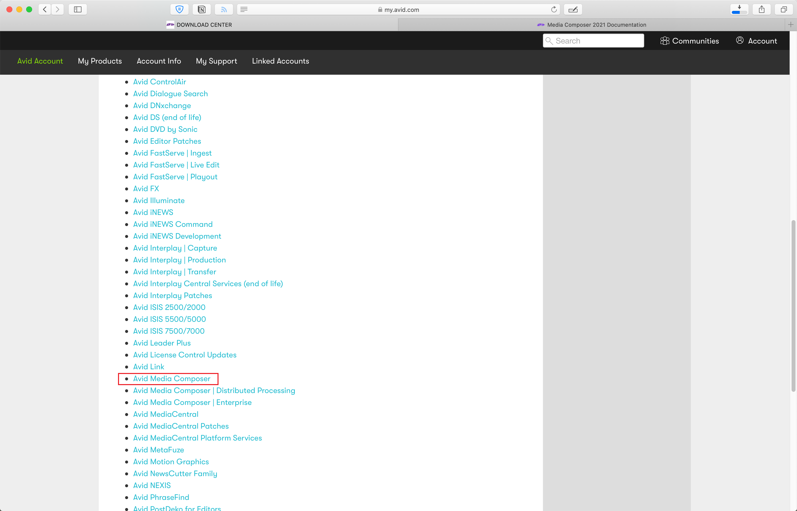

在Current Release中选择一个版本下载，此处选择的是2020.12

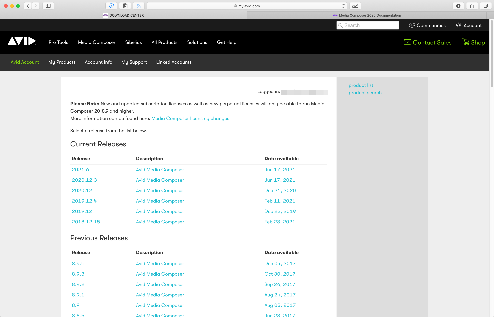

根据自己的系统版本，点击对应的下载链接即可下载。

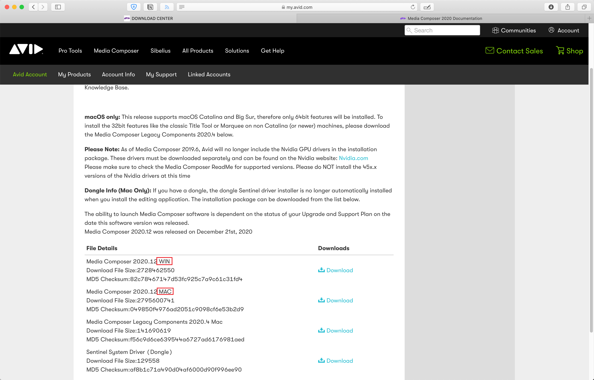

在你完成软件下载后，**强烈建议**你单独下载一份当前版本的软件操作手册。它的名字是Media Composer Editing Guide。

点击**指南和其他资源**

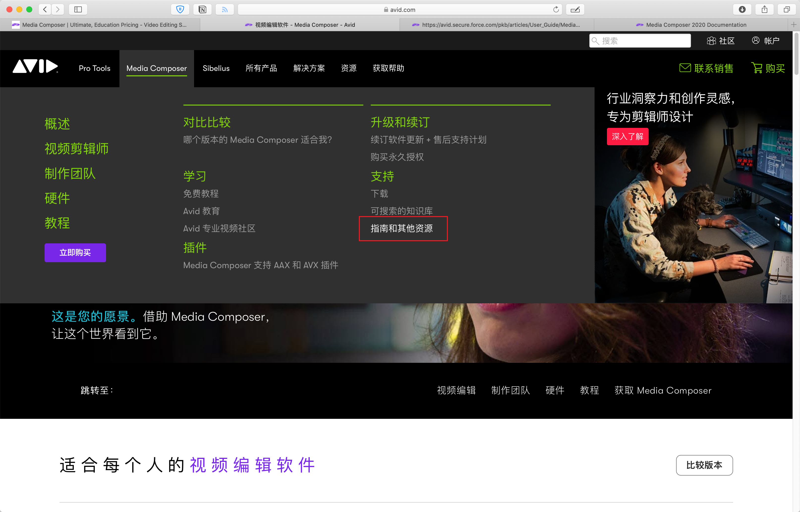

点击**请参阅所有文档**

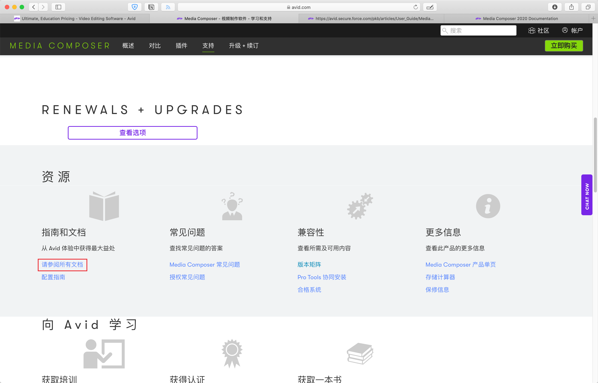

此处你跳转到了Avid Knowledge Base的子页面。点击对应版本的Documentation（此处我的是2020版本）。

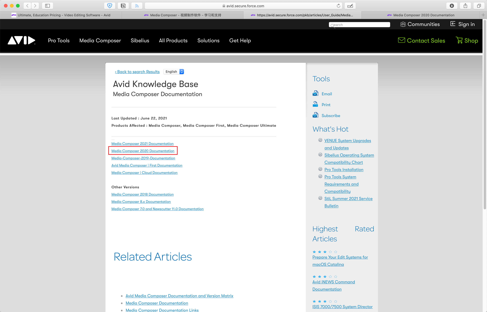

下滑找到Editing Guide并点击下载。

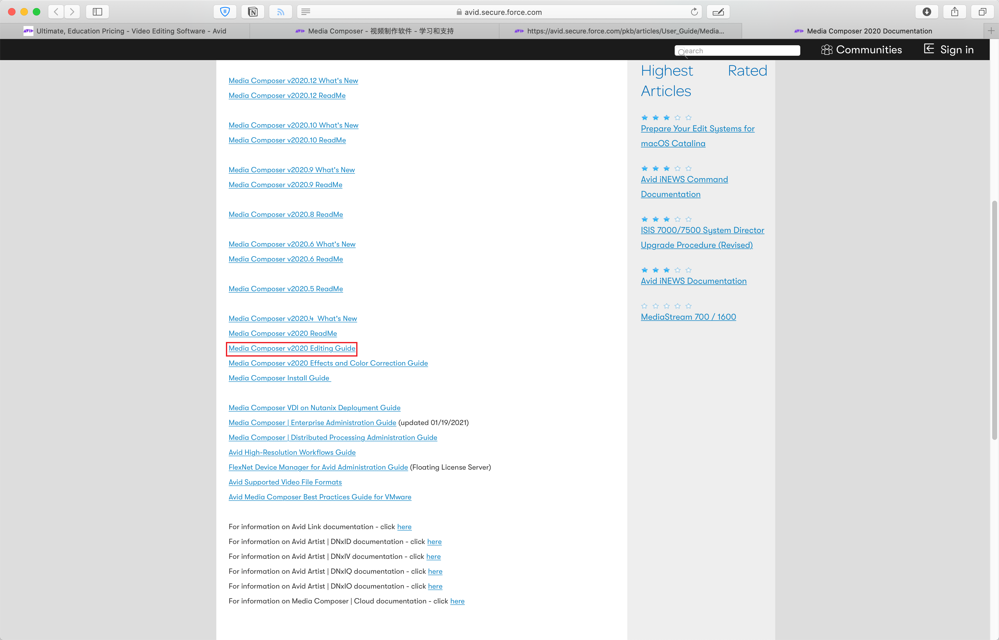

在后续的学习中，如果你对软件中的某个功能或选项有疑问，可以直接在手册或前文提到的Knowledge Base中搜索，基本都能够解决你的问题。二者目前都只有英文版。

事实上，在学习一个软件的过程中，查阅手册是一项相当重要的能力，也是一个好习惯。你无需将手册从头读到尾，只需要在有疑问时查阅对应的内容即可。如果你的英语水平还不错，那么你完全可以独立解决学习Avid MC过程中的许多问题。

## 软件版本与授权

### 1.软件版本

Avid MC有多个版本，分别是：

- Media Composer｜First
- Media Composer
- Media Composer｜Ultimate
- Media Composer｜Enterprise

其中Enterprise版本是针对大型广播和后期制作团队的，个人学习使用带或不带**Ultimate**的版本都可以，不要使用First版本。前三个版本对应的都是同一个安装包，软件会根据不同的授权而开放部分或完整功能。

关于几个版本的详细对比，可查看Avid官网网页https://www.avid.com/zh/media-composer/comparison

### 2.软件授权

除First版本外，Avid MC的其他版本均需收费。现阶段的授权主要是通过Avid Link进行的，这是一种和账户对应的在线授权方式。也有一部分授权使用加密狗进行。

如果需要长期使用Avid MC，建议购买授权。Ultimate版本提供了教育优惠，用教育邮箱注册并购买的话，按月订购是9.99美元/月，对应约65元一个月，可以说是相当便宜了（此处点名死贵的Adode）。如果你所在的学校或院系是ALP（Avid Learning Partner）的话，价格会更低。

如果你只是为了学习并熟悉Avid MC，安装后软件将提供30天的试用期，这将足够你熟悉Avid MC中的核心功能。

## 安装

下载后点击安装包完成安装过程。一般情况下采用默认安装即可。

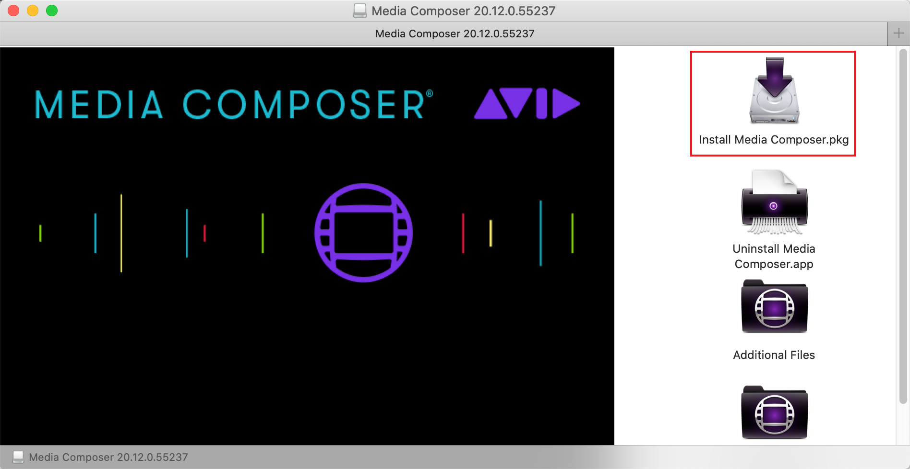

在安装完成后，请到以下目录中：

- mac OS：/Applications/Avid Media Composer/SupportingFiles/International/xml

- Windows：C:\Program Files\Avid\Avid Media Composer\SupportingFiles\International\XML

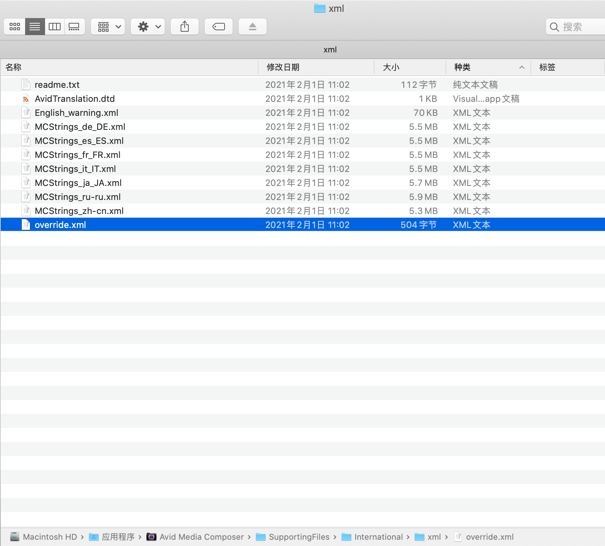

将English_override.xml改名为override.xml，从而使用**英文版本**的Avid MC（推荐使用英文版，可以避免许多问题）。看到这里不要慌，剪辑软件里的英语来来去去也不过是那几十个单词，花点时间很容易就能掌握。

打开Avid MC，检查是否能正常打开。这中间可能会弹出Avid Link的窗口让你登录账号，可以选择登录或在断网的情况下打开Avid MC（多试几次）。如果一切顺利，你将会看到这个界面。

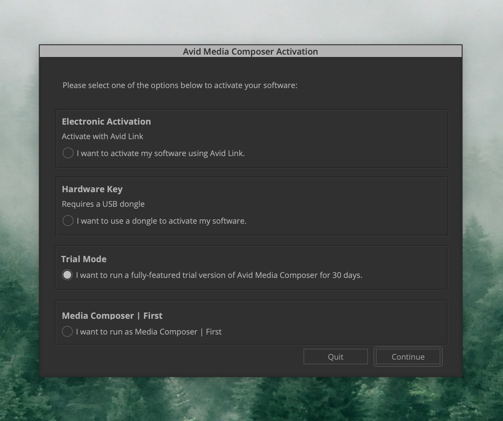

至此，你成功完成了Avid MC的安装。
