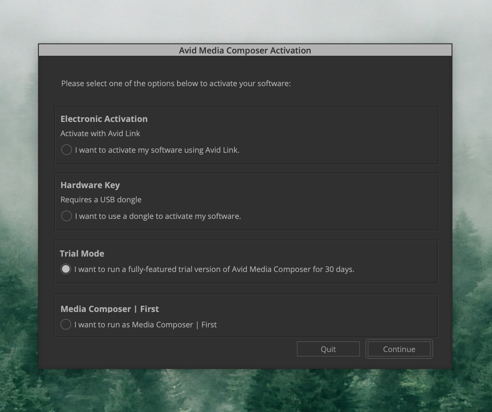
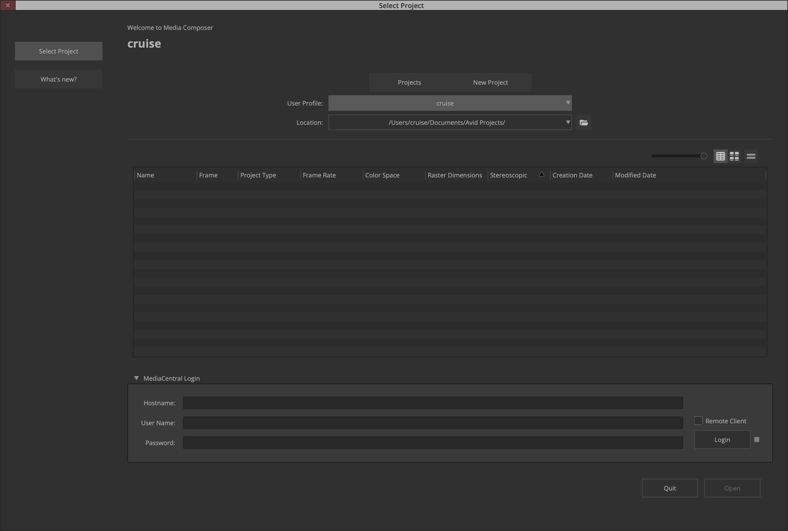
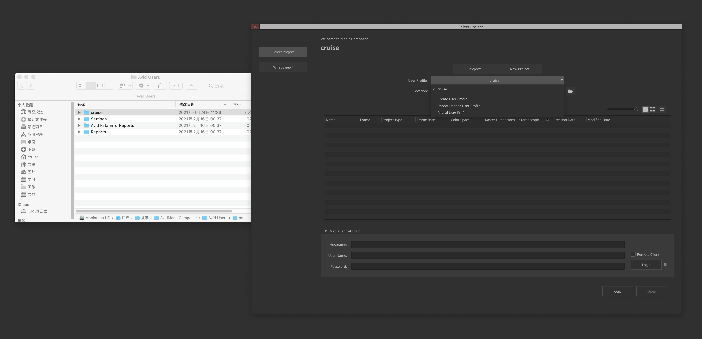
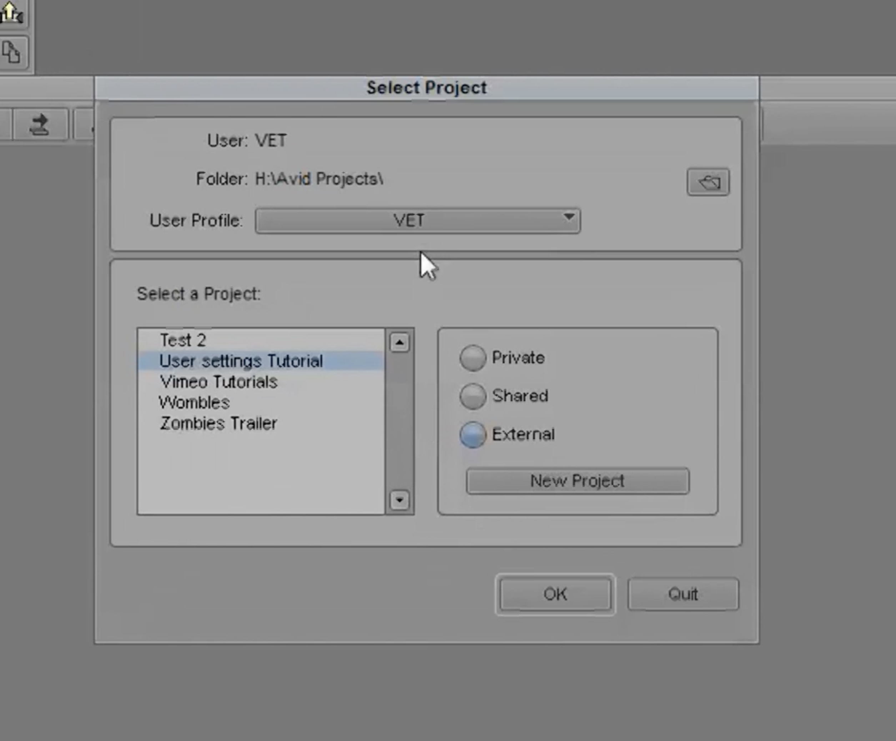
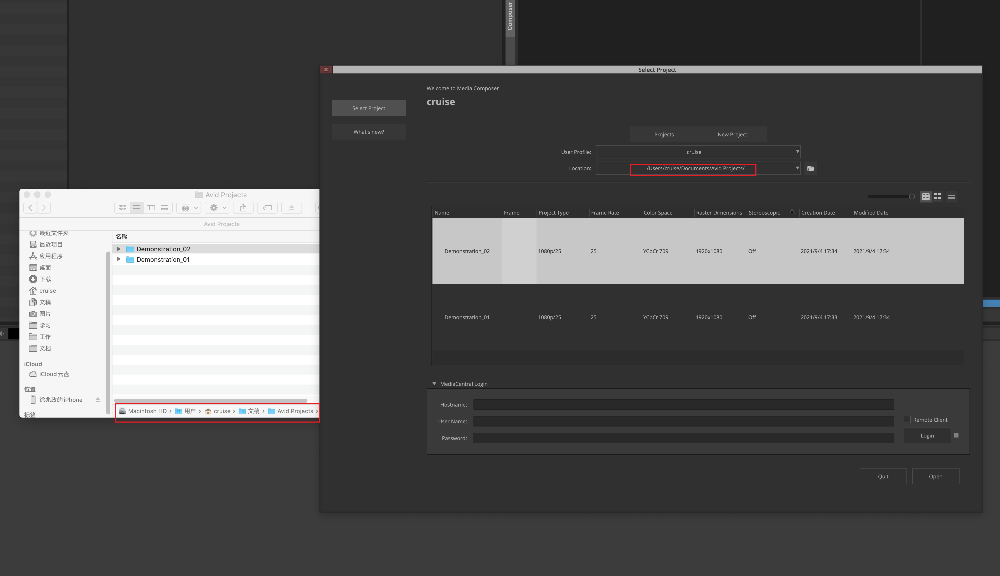
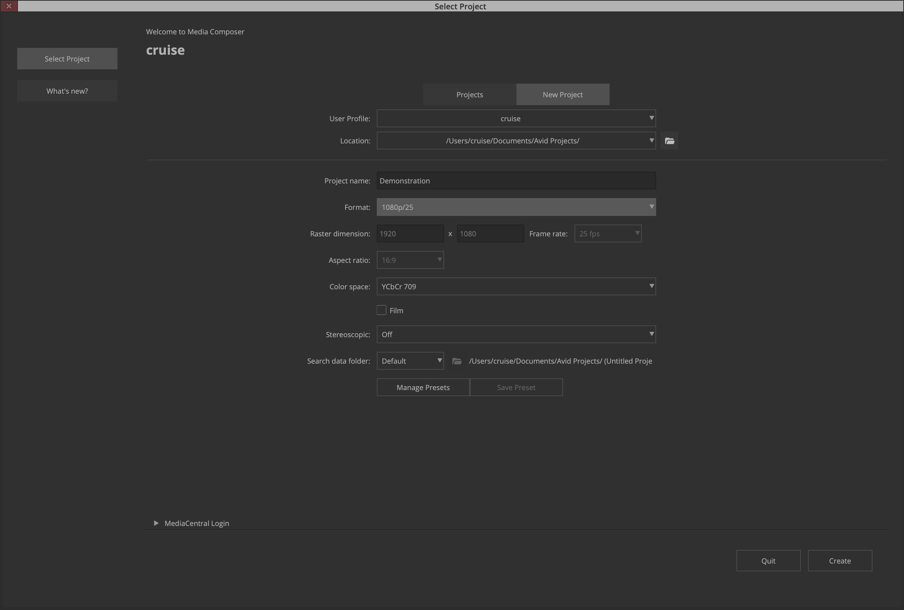
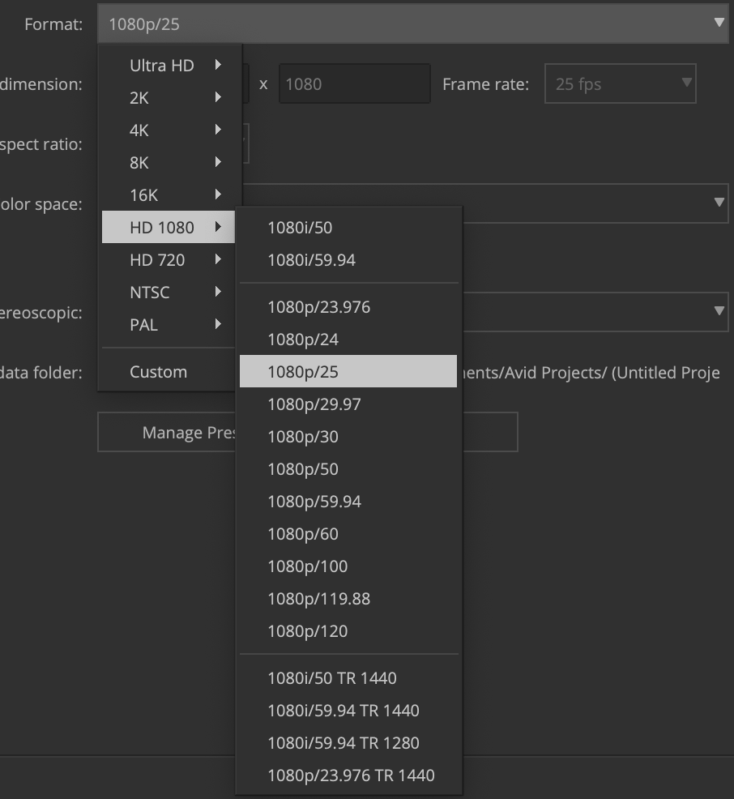
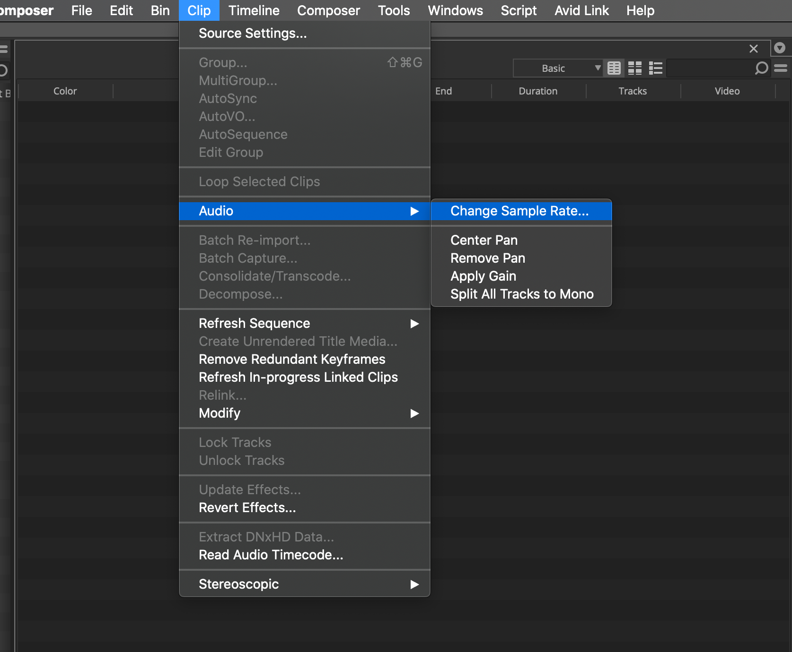

# 02 项目管理器与用户配置文件

在完成上节课**01 软件下载、授权与安装**后，根据你的授权方式选取对应选项进入Avid MC。我没有购买授权，所以在这里选取Trial Mode（试用）之后点击Continue（继续）。

## 项目管理器

打开Avid MC后，你会看到一个这样的界面。

这个界面就是Avid MC的**项目管理器**。

从上到下，我们可以看到几个选项：

### Project/New Project

你可以点击New Project（新项目）选项卡新建一个工程，也可以在Project选项卡中加载特定目录下的工程。

### User Profile

用户配置文件。在Avid MC中，用户对于**工作区布局**、**快捷键**等设置可以储存在用户配置文件中。用户需要使用另一台电脑的Avid MC时，可以在原先的电脑上导出自己的用户配置文件，再导入到另一台电脑的Avid MC中，避免了重新设置的过程。

点击之后出现几个选项，这里稍作解释：

- Create User Profile：创建用户配置文件，点选之后在弹窗中输入新用户配置文件的名字。应当以**英文、数字、下划线(_)及短横线（-）命名，不要包含中文，更不要包含emoji**，如：abc_20210904，后面可以带上你创建或修改这个配置文件的日期，方便管理不同版本的配置文件，以防一通乱改之后找不到原来的。
- Reveal User Profile：在访达/资源管理器中打开储存用户配置文件的目录。用户配置文件的名称与文件夹名称对应。关于更新、导入、导出配置文件的方法后续会提及。

- Import User Profile：导入用户配置文件，应该选择**整个用户配置文件的文件夹**，而不只是选择里面的.ave或.xml文件。在此处，则选择是的cruise这个文件夹。

### Location

在早期版本的Avid MC中，根据一个工程所在位置的不同，一个工程可以分为Private（私有）、Shared（共享）、External（外置）。

- Private：当前Windows或mac OS所登录的账户的**个人文稿文件夹**内，只有当前登陆的账户可以访问
- Shared：当前Windows或mac OS的**共享文稿文件夹**内，这台电脑上所有账户都可以访问
- External：用户自定义的位置，可以是**外置磁盘**或电脑内其他位置，装载磁盘的所有人都可以访问

而在新版本的Avid MC中，这三个选项并不直接存在。我们选择不同的Location（位置）时，Avid MC就会加载当前设定的Location下所有的Avid MC工程。

也就是说，根据我们的需求，我们可以将工程建在外置硬盘里，也可以将工程建在内置磁盘上。

如果你要将工程建在外置硬盘，建议你**在硬盘的根目录就建立一个Avid Projects文件夹**，并点击Location右边的文件夹图标，将外置硬盘的Avid Projects文件夹添加到Location列表当中，从而方便管理。

如果你要加载已经存在的工程，同样添加对应的“Avid Project”文件夹到Location中即可（事实上也可以双击工程文件夹内的.avp打开）。

### MediaCentral Login

关于Avid MediaCentral的相关选项。MediaCentral是一个Avid开发的面向新闻与体育赛事等媒体内容生产的平台，本教程不涉及。感兴趣的可以看官网相关内容。

链接在此：https://www.avid.com/zh/products/mediacentral

## 创建新工程

### 基本设置

点击New Project选项卡，可以看到创建新工程的许多选项。

这里稍作解释：

- Project name：工程名称。同样要以英文、数字、短横线及下划线命名。
- Format：格式。这个选项中是一些工程分辨率和帧率的预设。

- Raster dimension、Aspect ration：分辨率与画面宽高比。**多数情况下选择1920*1080**。当选择了Format中的分辨率预设时，该选项无法被修改。如果需要创建特定分辨率和帧率的工程，需要在Format中选择Custom（自定义）后方可输入目标分辨率、帧率。**除非你清楚自己的设置是什么以及如此设置的后果，否则请使用预设！**

- Color space：色彩空间。该选项设定的是Avid在该工程的工作色彩空间。对于绝大部分代理素材，选择YCbCr 709。YCbCr和RGB是两种对色彩进行编码的不同方式，在Data Level上，此处YCbCr对应的是Legal、RGB对应的是Full。（如果你没有看懂这句话，可以看龙代师的文章（链接））
- Film：剪胶片拍摄的项目时需要勾选。选了之后会出现以片孔为单位微调声画同步的选项。本教程不涉及。

- Stereoscopic：3D（更准确的提法应该是立体）工程相关选项，除非要剪3D项目，否则默认选择Off即可。
- Searchdata folder：储存Pharsefind数据库的文件夹。一般设置成Default（默认）就行。Pharsefind，简单说就是Avid MC在后台分析素材的音频，分析完成后，你只需要在Pharsefind输入框中搜索一句台词，然后Avid MC就会帮你找到有这句台词的素材。目前已经支持中文，是授权后Ultimate版本的特有功能。本教程不涉及Pharsefind相关内容。

- Manage Preset、Save Preset：管理和保存预设。可以将当前工程设置存成预设，方便以后使用，但大部分情况下用不到。
- 音频采样率：默认是48kHz。如果需要修改需打开工程后在顶部菜单栏Clip>Audio>Change Sample Rate中修改。

