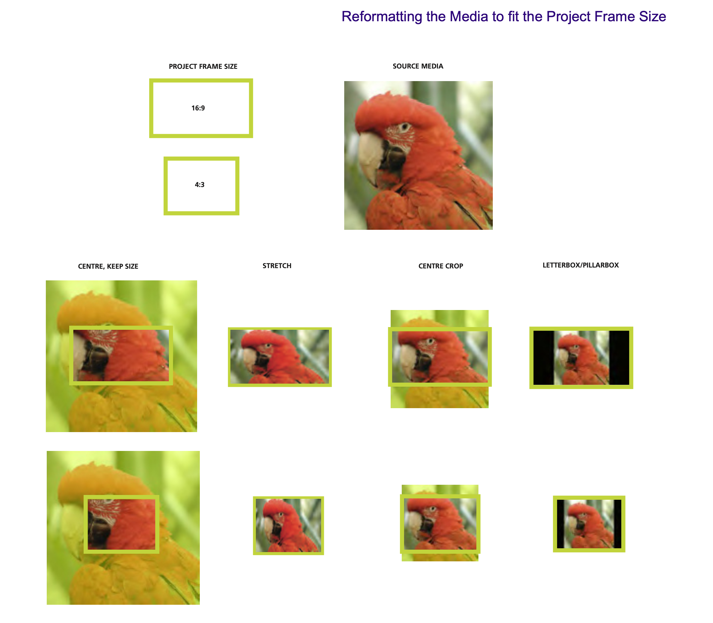
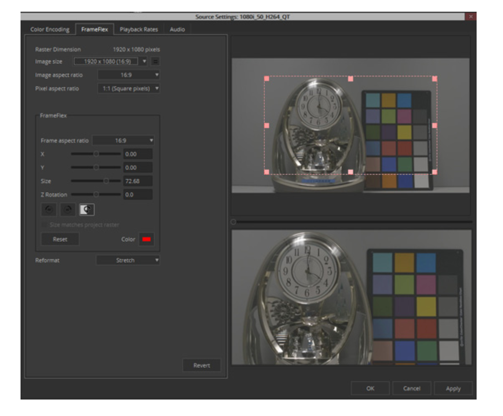

# 创建工程时的注意事项

我们最好在创建工程时，就一次确定工程参数，而不是在项目中途进行修改。如工程命名、帧率、分辨率、宽高比、工程位置、音频采样率等的选项如果一开始没有设置好，就会在与下游部门的交接中造成麻烦。

下方讨论中的一部分已经超出了普通剪辑人员所关心的范畴，但是所讨论的内容可以帮助你更清晰地了解问题。

首先要明确的是，**上述设置和最后成片的规格相同/相关**。

### 1.帧率

值得注意的是，在Avid MC中，**一旦成功创建项目，该项目的帧率就无法修改**。因为在工程内部，项目帧率和时间线时间码息息相关，**错误的时间码将给后续套底带来灾难性的后果**。

如果我们最后要交付的是一个25fps的视频，就应该建25fps的工程；要交付的是24fps的DCP母版，就应该建立24fps的工程。

但是可能会出现这样一种情况：明明成片要求是24fps，但是前期却拍了25fps，在这种情况下，我们的工程依然应该按照成片的帧速率设置。**这种错误体现出的是摄影组的不专业**。

### 2.分辨率与宽高比

基于以上关于帧率的讨论，我们假定这是个专业的摄影组，有专业的DIT来保障前期拍摄，帧率、分辨率等的基本参数设置不会出错。

在绝大部分情况下，我们在Avid MC剪辑使用的都是代理文件。为了由浅入深地理解如何正确设置Avid工程的分辨率与宽高比，我们从最简单、最基础但并非最普遍的一种情况出发。

成片分辨率与宽高比要求如下：

- 分辨率：3840*2160
- 宽高比：16:9

现场拍摄的原素材规格如下：

- 分辨率：3840*2160
- 宽高比：16:9

DIT转码提供的代理文件规格通常如下：

- 分辨率：1920*1080
- 宽高比：16:9

在这种情况当中，成片、原素材、代理素材的宽高比都是16:9，因此我们无须裁切素材或给素材添加遮幅。工程分辨率顺理成章地应该是1920*1080。

这种最简单的情况下，正确设置工程并非难事。但是此时我们可以思考几个问题：

- 代理文件分辨率一定是1920*1080吗？
- 如果成片宽高比是2.39:1，我们又该如何设置？
- 如果源素材宽高比是1.44:1，代理文件的宽高比与分辨率又该如何？对应的工程设置又应当如何？

如果你有过一些实操经验，那么你下意识地会想到，我们要对素材进行缩放、裁切或是遮幅，最后才能得到对应规格的成片。但问题是，在什么阶段进行这些缩放、裁切的操作呢？

要回答这个问题，我们就需要先思考，我们需要达成什么效果，以下我罗列了最基本的几项：

- 在剪辑软件内就能预览到最后成片的构图，无需脑补遮幅
- 尽可能地建立标准分辨率的工程、生成标准分辨率的代理以防止出现问题
- 尽可能减小缩放裁切操作对原来Burn-In的影响
- 对于各种分辨率宽高比的源素材和代理，都能很好适应
- 这一阶段的缩放裁切操作不影响剪辑时的缩放裁切操作

大部分网站、教程上，对于这一点都是草草带过，或者干脆写一句根据项目需要进行设置。

这里给出一套解决方案，供参考。

#### 代理文件的分辨率与宽高比

首先要明确的是，代理文件的分辨率和宽高比往往由DIT来设定，而DIT出转代理时的一个原则就是不裁切源素材。所以DIT要么按照源素材的比例出代理，要么在代理上下加黑边以满足将其放在一个**标准分辨率或宽高比的”容器“**当中。这里举几个例子：

- 情况A：源素材分辨率为4448\*3096，宽高比约为1.44:1，那么代理文件分辨率为1920*1440，宽高比为4:3（上下加黑边）
- 情况B：源素材分辨率为4448\*1856，宽高比约为2.39:1，那么代理文件分辨率为1920*1080，宽高比为16:9（上下加黑边）
- 情况C：源素材分辨率为3840\*2160，宽高比为16:9，那么代理文件分辨率为1920*1080，宽高比为16:9（无黑边）

不在代理素材中左右加黑边的原因在情况A中很容易解释。如果我们在1.44:1的画面左右加黑边从而达到16:9的宽高比，我们就需要手动计算素材的缩放才能“消除”左右的黑边。如果采用上下加黑边的方式就比较简单，直接将素材缩放方式设置为Center Crop（Avid Frameflex）或叫Fill（Davinci Resolve），从而只显示其中16:9的部分。

> Avid Frameflex是Avid MC内一个能够将与项目分辨率不同的素材调整至适用当前项目分辨率的状态的工具。

此外要注意的是，第一，DNxHD编码并不支持1920*1440的分辨率，所以需要使用DNxHR；第二，Burn-In最好不要直接加在图像四角，而应该直接放在构图参考线内，防止被遮掉。

#### 工程的分辨率与宽高比

大部分剪辑的监看设备的宽高比是16:9（电脑屏幕、监视器、电视），并且1920\*1080能够较好地兼容各种宽高比的素材，因此，**将工程分辨率设置为1920*1080是多数时候的选择**。

在处理与工程分辨率不同的代理素材时，应当灵活使用Avid MC的Frameflex功能正确“解释”素材。

需要时，我们可以在工程内按照成片宽高比来加遮幅，从而达到更好的预览效果。注意，对于源素材的缩放、位移最后是在DI部门实现的。

### 3.工程及其他命名

即使今天大部分剪辑软件已经支持了中文等CJK字符的正确显示，但是**用英文、数字、短横线及下划线完成文件路径、素材、工程、时间线、输出文件等的命名依然是一个好习惯**。

因为软件的UI支持中文的显示，并不代表软件导出的用于交接的EDL、XML、AAF支持中文。这些文件里面所包含的**时间线、素材信息本身是相当大一部分是不支持中文的**，最典型的例子就是卷名（Tape/Reel）。

比较常见的一种情况是，在与声音部门交接时，因为使用的音频素材文件名或所在路径中含有中文或一些特殊字符，导致剪辑部门导出的AAF在导入Pro Tools后引发了软件崩溃。

在使用规范的字符进行命名的前提下，一个优秀的文件/路径名可以包含**项目名称、版本、创建日期、创建者/接收者**等的信息，但是也不应设计得过于复杂造成麻烦。后续讲解部门间交接规范的专栏文章会展开讲这一点，此处不赘述。

特别需要注意的一点是，**不要更改DIT提供的代理的文件名**！之所以单独提出这一点，是因为有的剪辑人员习惯将文件名改成该条素材对应的场镜次，但是这可能会对后续套底造成不小的麻烦（特别是使用了文件名做卷名的情况）。我们需要区分的是，一条素材有它的Filename（文件名），也有它的Clipname（片段名）。我们需要做的是在剪辑软件内维护它的Clip name，而不需要去修改它的Filename。一条素材，Clipname和Filename两者完全可以是独立的事实上有相当一部分人不知道可以在剪辑软件里修改一个素材的Clipname）。

### 4.色彩空间

我们假定源素材的色彩空间是 Arri Wide Gamut，OETF是 Arri LogC。在简单一点的情况下，DIT会对源素材应用一个从Log to 709的转换，转码生成的是套了LUT的代理，在复杂一点的情况下，可能还会有现场调色产生的CDL信息。

事实上，将LUT在转码时应用到给剪辑部门的代理上这一操作并不是必须的，我们可以通过别的手段将这个LUT传递给剪辑部门，让他们在剪辑软件里应用这个LUT（从而达到对图像的非破坏性修改）。但是大部分情况下，我们还是选择将LUT在转码时就应用到代理素材上。

大部分情况下，代理文件的色彩空间是Rec.709，而最后成片的色彩空间可能是DCI-P3甚至Rec.2020。在剪辑环境内，工程的色彩空间与数据级别与代理文件匹配即可。

对于绝大部分代理素材来说，其对应的色彩空间设置都是YCbCr 709。这里数据级别选择错误可能会导致素材在Avid MC中看起来发灰或对比度过高。关于数据级别的知识请看龙代师文章。

> 使用了ACES（Acamemy Color Encoding System，学院色彩编码系统）的项目实际选项会不同，具体请查阅手册

