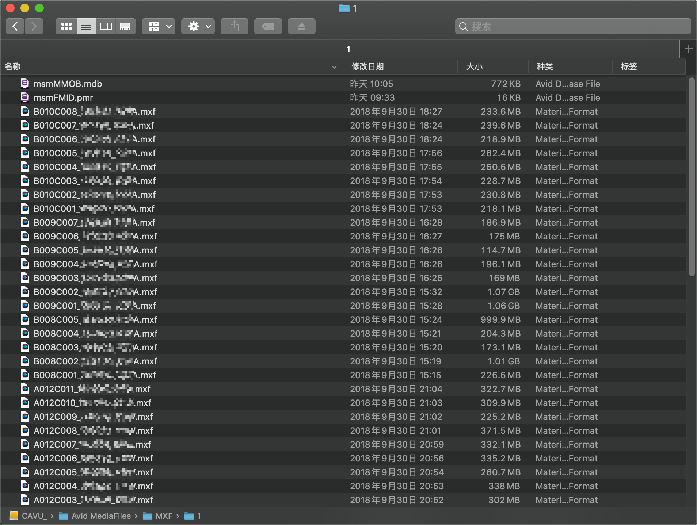
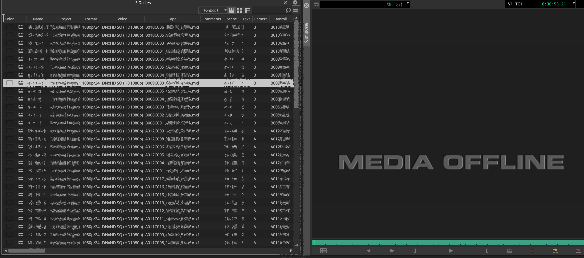
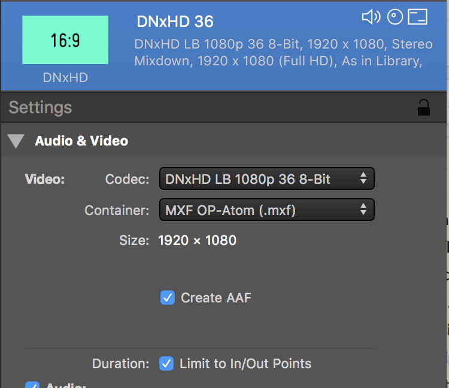

# 04 素材的管理与导入

在完成上节课 **03 创建工程时的注意事项** 后，相信你已经掌握了如何依据项目与素材需求建立工程。

## 导入是什么

**我们将一条素材导入到剪辑软件，事实上是在剪辑系统中创建了一个Clip（片段），并将其指向对应的文件。**

当这个Clip对应的文件被改名或路径发生变化时，我们就会在软件内看到这条素材处于脱机状态（Media Offline），需要重新将Clip与对应文件链接。我们可以在剪辑系统内查看这个Clip所对应素材的元数据，也可以对它添加新的元数据。

## 其他软件中素材的导入

如果你没有接触过其他剪辑软件，请直接跳到 <u>Avid MC中的素材导入</u> 这一标题中。

首先让我们回想一下，在我们使用其他剪辑软件时，素材是如何被导入的（此处不讨论利用采集卡直接采集素材）：

### Premiere

- 简单版：右键素材或素材的文件夹导入，或者直接拖进素材箱
- 进阶版：通过DIT提供的XML将素材导入，并重新链接素材

### Davinci Resolve

- 简单版：右键素材或素材的文件夹导入，或者直接拖进媒体池
- 进阶版：通过DIT提供的XML导入素材，并重新链接，利用CSV导入元数据

这里的进阶版大部分人都不知道……因为大家导入素材已经习惯了直接拖。在我们完成素材的导入之后，**我们并没有生成新的文件**，素材始终处于原来的位置，而是以Link到文件路径的方式引用素材。

注意，这里我并没有特别指明导入的是否是代理素材。不管是代理素材还是源素材，都可以用上面提到的方式进行导入。

那么在Avid MC中又是如何导入素材的呢？

## Avid MC中的素材导入

### 初识Bin

**首先要明确的是，我们将素材导入剪辑软件时，一定会导入剪辑软件当中的一个Bin**。Bin，在Premiere中对应的中文是素材箱，在Resolve中对应的中文是媒体夹，在Avid MC中对应的中文是素材屉。显然，我们都用Bin来称呼它们会更加方便（也是将软件改成英文版的一个原因）。

我们进入到项目当中，可以看到已经有一个以项目名称命名的Bin。双击红框位置的这个Bin，我们将它打开并加载到右侧。

右键左侧空白处，我们可以点击New Bin新建一个Bin。

当我们新建一个Bin后，在工程文件夹内会出现一个.avb文件，一个.avb文件就是一个Bin。

下图所示的一整块区域被称作Bin Container。你可以将Bin Container想象成一个浏览器，侧边栏中的Bin列表就像是不同的标签页。一个Bin Container中可以加载多个Bin。注意观察打开和关闭的Bin小图标有所不同。右键左侧紫色区域可以对Bin Container重命名。

Bin中记录了素材的各项元数据，如Tape（卷名）、Soundroll（声音卷号）、Start TC（起始时间码）、White Balance（白平衡）等。我们在与其他部门交接时会用到这些元数据，因此要注意对于元数据的管理。

Bin内除了可以存放素材，还可以存放时间线、字幕文件、效果预设等，后续专栏会讲到。

### 将素材导入Bin的三种方法

在看这篇教程前，你也许听说过这样一句话：

> Avid导入素材的时候都要转码成Avid的编码，要等很久才能导入。

这话对，但是也不对。将素材导入Avid MC的正确方式其实有三大类，分别是Import、AMA Link和AAF/ALE，分别适用于不同的情形。在本节教程中先粗略讲解原理和操作方式，其中的细节问题将在下节课中讨论。

**我们导入素材到Bin中，实际上是创建了Master Clip（主片段**）。我们可以取Master Clip的一部分创建Subclip（子片段）。注意Bin中Master Clip和Subclip的图标不同。下图中，Master Clip的小图标有六个片孔，而Subclip只有三个，

#### 1.Import

Import（导入）其实就是一些人所知道的“素材进Avid要转完码才能剪”。

我们使用Import的方式导入素材时，素材会被转码成指定编码的，音视频分开的，MXF封装的文件。转码后的文件会生成在Import时所设定的内部素材文件夹中。在完成Import后，Avid MC在剪辑过程中就不会调用源素材，而只访问转码完成的素材。直到剪辑完成，最后输出时才使用源素材输出。

这里面有几个要点，我们来逐个分析。

##### 音视频分开

假设我们的源素材是文件名是A001C001_210907_R234.mov，由一条视频轨和两条音轨组成。那么在Import后，新生成的文件会类似于：

- V01.DD5E5497_9E81E9E81E410V.mxf
- A01.DD5E5498_9E81E9E81E490A.mxf
- A02.DD5E5498_9E81E9E81E490A.mxf

分别对应着一个视频轨和两个音频轨。V01、A01、A02后面跟的是Avid MC对这段素材的标识符。

##### MXF封装

Avid用Import方式导入的素材都要求以mxf重新封装，表现为新生成的文件后缀名为.mxf。关于MXF是什么以及为什么要用MXF，可以自行使用搜索引擎查找相关资料。

##### 内部素材文件夹

在用户Import素材的目标磁盘上，会有一个Avid Mediafiles文件夹，这个文件夹由Avid MC管理维护，我们称之为Avid MC的内部素材文件夹。需注意的是，对于外置磁盘来说，Avid Mediafiles文件夹必须位于磁盘根目录上。我们可以自行在磁盘上创建内部素材文件夹的目录。

Import的方法如下。我们选中一个Bin，右键右侧空白处，选中Import Media后会出现文件浏览器的界面。

先不要急着选中一个素材就导入。点击左下角的选项，我们可以看到当前导入的更多选项。

这里稍作解释：

- Option：选项。这个按钮对应的是Avid MC对于Import的其他高级选项
- Enable：启用。相当于一个筛选器，筛选出当前目录中特定种类的媒体。如点选mxf后，非.mxf封装的文件就会变灰无法选择。
- Resolution：分辨率。这里Avid MC的Resolution其实并不严谨，实际上这个选项描述的是Codec（编码）。**这个选项指定了Import的素材会被Avid MC转成什么编码的文件储存在其内部素材文件夹中**。
- 箭头：指定Import素材的目标磁盘。两个箭头合并指的是音视频都导入到同一个目标磁盘，分开指的是音视频导入到不同的目标磁盘。点击箭头可以切换合并或分开。如果该磁盘没有Avid Mediafiles文件夹，则在Import时自动创建。
- Disk Label：磁盘标签。需要导入多个磁盘的文件时，可以为每个磁盘自定义一个Disk Label方便管理多个磁盘。(对于XDCAM适用)

**必须要明确的一点是，不是所有类型的素材都能够以直接Import的方式导入到Bin里面当中。**当你尝试导入一个当前项目设置下不支持的媒体，Avid MC就会提示你无法Import该种格式的文件。

**对于视频素材，Import不是我们导入第三方软件（Resolve、Silverstack）生成的代理素材的方式。**它更倾向于直接导入广播摄像机的素材，并由Avid MC完成转代理的过程。

**对于音频素材，我们可以直接将音频源文件Import到对应的Bin中**，而无需在其他软件中将其封装成mxf后，再用其他方式导入Avid MC。但是需要注意的是，Avid MC在Import时会将每个声道拆分成不同的文件·，因此在导入时要做好对应的声道匹配设置。

对于不那么常用的图片素材，我们同样可以将其Import到对应的Bin中，Avid MC为我们提供了导入图片时处理Data Level、Alpha通道等的许多选项。

这里我导入一个AVC-Intra编码的mxf封装的视频文件，并将目标编码设置为DNxHD LB，目标磁盘为CAVU_。可以看到该素材被成功Import，Bin中出现了该素材的Master Clip，内部素材文件夹中也出现了三个mxf文件。

#### 2.AMA Link

AMA Link的全称是Avid Media Access Link，顾名思义，是Avid MC以Link的方式直接访问源素材的导入方式。这就和Premiere、Resolve中大部分人导入素材的方式一样。

我们使用Link的方式导入素材时，源素材不会被转码或迁移，而依然位于原来的位置。与Import不同，Link支持的编码格式多种多样，并且可以凭借AMA插件来丰富支持的编码。

Link的方法如下。我们同样右键右侧空白处，选择Source Browser（资源浏览器）。	

点击之后会出现资源浏览器界面。我们选中文件或文件夹，就可以将目标素材Link到Bin中。

这里对界面中的选项稍作解释。Source Browser Settings一栏中，是关于使用习惯的一些设置，不影响Link操作，这里不作解释。

可以看到，下方有同时有Link或Import的选项。Link和Import都能在Source Browser中进行，并通过右边的齿轮图标设定更多选项。Target Bin则指定了Import或Link的目标Bin。

在这里，我依然选择相同的素材，并点击右下角的Link按钮。

可以看到素材被成功Link。需要注意的是，Link的素材与Import的素材小图标不同，Link的图标会多一个锁链，表示当前Master Clip是通过Link方式创建的。

对于Link导入的片段，我们可以称之为**外部素材**。其特点是，素材可以位于任意文件夹中。Link支持的素材格式多种多样，包括各种编码的视频、音频，也包括图片。

Link的另一个特点是，不论素材是否符合当前项目设置（帧率、分辨率），只要AMA插件支持，我们都可以将其以Link的方式导入到Bin中。

我们可以对Link素材进行Transcode（转码）或Consolidate（合并）操作，使之转为内部素材。

Transcode的主要应用是使素材转为符合当前项目要求的素材，我们可以指定Transcode生成的素材的帧率、编码、分辨率、音频采样率等参数，并在完成后将新文件储存到内部素材文件夹中。

Consolidate的主要应用则包括复制完整或部分素材到内部素材文件夹、迁移当前素材到另一磁盘、备份素材等。如果某种编码不支持Import，但是可以Link，我们就可以先Link后Consolidate，将其转为内部素材。

操作方法是，右键Link导入的素材，选中Consolidate/Transcode。这一操作并不常用，但是会在后续专栏文章中涉及。

#### 3.AAF/ALE

在实际生产中，我们往往在Silverstack、Davinci Resolve、Scratch等DIT软件中对源素材进行转码生成代理文件，**对于这类素材，我们可以使用AAF/ALE的方式来进行导入。**

##### 01 AAF是什么

AAF（Advanced Authoring Format，高级创作者格式），常用于在不同的应用间交换数据，后面我们在与DI部门和声音部门交接时也会用到。**AAF描述的是Master Clips和对应媒体文件的关联信息**。

AAF文件是二进制编码的，我们无法直接使用文本编辑器将其打开、修改。需要解析、修改AAF时，你可能需要一定的编程知识，借助Python中的pyaaf或pyaaf2库进行AAF的解析。

##### 02 ALE是什么

ALE（Avid Log Exchange）是一种记录了许多素材元数据的表单，是ASCII码编码的文本文件，因此可以由文本编辑器读取修改（素材的路径与文件名中不应该有任何的中文字符等非ASCII字符）。

我们可以用文本编辑器或Excel打开ALE。此处为了方便观看，我们使用Excel打开。

上方的Heading（文件头）中，说明了**这个ALE的所适用的项目分辨率与帧率**；下方的表格中则记录了素材的元数据。

需要打开ALE修改其中的数据时，我们可以借助Excel或VSCode进行修改。关于Excel修改ALE的方法可以参考黄烁老师的文章。

https://mp.weixin.qq.com/s/-a7Hc9Hkin5X-RHHrUCn9A

我们可以**只通过AAF导入素材**，也可以**只通过ALE导入素材**，也可以**两者相结合**。

#####  03 通过ALE导入素材

Avid MC以ALE方式导入的**代理素材**需满足以下三个要求：

- DNxHD/HR编码
- MXF OP-Atom封装
- ALE文件头中帧率、分辨率、音频采样率完全符合当前项目设置

在这个流程中，**ALE是DIT部门在转代理时生成的，并在素材交接时随代理文件一同交给剪辑部门。ALE中记录的应该是源素材的信息，而不是代理素材的信息。**

ALE导入素材的操作如下：

1. 在Avid MC关闭的情况下，将代理素材拷贝到内部素材素材文件夹中的其中一个数字文件夹中。如：Volume/Avid Mediafiles/MXF/1/

2. 拷贝完成之后，如拷贝的位置已经存在mdb与pmr文件，则将其清除。如不存在则跳过此步。这一步的目的是确保Avid MC启动时扫描了新拷贝进去的代理素材，并生成了新的mdb与pmr文件。

3. 导入完成后，打开Avid MC对应的工程，使用Import的方式，点选ALE文件（.ale），在导入之前，进入Import的Option中，点击Shot log栏，确保选中"Maintain events as logged".

> Maintain event as logged：ALE中的每一个素材都可以被认为是event（事件）。选择此选项后，Avid MC将会为ALE中的每一个素材创建一个Master Clip。

4. 点击Import，完成导入后，可以看到Bin中多了ALE所记录的素材的Master Clip，但是出现Media Offline的警告。

5. 选中之前创建的所有Master Clip，右键选中Relink。

> Relink即重新链接。我们Relink素材的依据包括卷名（Tape）、时间码（Timecode）、文件名（Filename）等。

下面简单解释一下Relink选项。

- Relink by：Relink by一栏是选择重新链接的依据。一般情况下保持默认设置即依照Start TC和Tape Name匹配即可（也可以依照文件名）-

- Target(if different than Original)：当代理素材的信息与ALE中所记录的信息不同时，我们才会勾选Target(if different than Original)，并选择对应的匹配依据。

- Ignore extension：大部分情况下，我们会勾选Ignore extension（忽略文件拓展名），因为源素材的封装格式往往和代理素材的封装格式不同。
- Match case when comparing source names：是否匹配大小写，一般会勾选。

- Video Parameters（视频参数）：这一栏则是选择链接内部素材文件夹中何种规格的素材。当内部素材文件夹中存在多个对应同一素材的文件时（如以不同编码将素材Import），则需要选择对应的Video Parameters选项来Relink其中特定的某一个文件。
- Tracks to relink：选择要重新链接Master Clip的哪些轨道。如果需要，可以只链接视频、音频或数据轨（甚至可以做到一个Master Clip的视频轨道来自A文件，音频轨道来自B文件）
- Allow relink across rates：绝大部分情况下不会勾选，因为源素材、代理素材、项目的帧率是一致的。

6. 取消勾选Load files from current project。我们要导入的素材还不属于当前项目，因此此项要取消勾选。
7. 选择对应的Relink选项，完成后点击OK。Relink的本质是让Avid MC在指定的磁盘中搜索对应的文件，并重新建立对文件的引用。
8. 如果看到对应的素材出现在源监视器中，则Relink完成。

在导入完成后，我们可以看到Bin中出现了对应的Master Clip，并带有ALE中的元数据。

需要注意的是，使用ALE导入音频素材并不方便。

##### 04 通过AAF导入素材

通过AAF导入素材的思路大致与通过ALE导入的相同。AAF同样是由DIT部门提供的，并在素材交接时随代理文件一同交给剪辑部门。

其操作如下：

1. 在Avid MC关闭的情况下，将代理素材拷贝到内部素材素材文件夹中的其中一个数字文件夹中。如：Volume/Avid Mediafiles/MXF/1/

2. 拷贝完成之后，如拷贝的位置已经存在.mdb与.pmr文件，则将其清除。如不存在则跳过此步。这一步的目的是确保Avid MC启动时扫描了新拷贝进去的代理素材，并生成了新的mdb与pmr文件。

3. 导入完成后，打开Avid MC对应的工程，使用Import的方式，点选AAF文件。
4. 可以看到，素材已经全部导入，并且处于Online状态。

在导入完成后，我们可以看到Bin中出现了对应的Master Clip，但元数据并没有被一并导入。

##### 05 通过AAF+ALE导入素材

只通过AAF导入素材的方法并不完善，因为这种方法只是将素材导入进了Bin中，而没有同时带入素材的元数据（Metadata）。

在Avid官方的一篇文档《Avid Workflows for Digital Cinema Cameras》中，推荐了一种AAF+ALE导入的方法，其思路是先通过AAF导入素材使之处于Online状态，然后再通过ALE将其中的元数据合并到Master Clips中。AAF与ALE往往是由DIT部门提供，并在素材交接时随代理文件一同交给剪辑部门。

   操作方法如下：

1. 按照<u>04 通过AAF导入素材</u>中的方法创建Master Clips后，全选刚才创建的Master Clips，右键，选择Import Media。
2. 点击Option，切换到Shot log面板，选择Merge events with known Master Clip。

> Merge events with known Master Clip：选择该选项后，Avid MC将会**对比Bin选中的Master Clips与ALE中记录的素材的Tape栏是否一致**，如果一致，则根据Start TC来匹配，将ALE中的元数据合并到对应的Master Clip中。

3. 点击OK，并完成Import。

通过此方法，我们不仅导入了素材，并且导入了素材的元数据。AAF可以导入视频素材，也可以导入音频素材。

#### 4.不推荐的素材导入方法

##### 01 通过MDB文件导入

当我们将内部素材文件夹中的mdb文件拖拽到Bin中，该内部素材文件夹中的素材也会被导入（带元数据）。但这种方法有一些缺点：

- 会导入当前内部素材文件中的所有素材，不论该素材是否属于当前项目，可能造成混乱。
- 当代理素材的的元数据中没有卷号这一项时，Bin中的Tape栏会得到错误数据，对后续套底造成灾难性的后果。

当DIT部门没有提供AAF/ALE时，可以使用此方法将素材导入Bin中。但并不推荐用这种方法导入素材。

## 总结

总结上述的几种方法，我们可以把素材的导入分解为两个步骤：

1. 在Bin创建Master Clips
2. 导入对应Master Clips的元数据

对于涉及部门间交接的工作流程来说，第二步导入的元数据是必不可少的。如果需要，我们可以灵活组合上述导入方式，如通过Link的方式创建Master Clip，再通过Merge方式导入ALE完成元数据的导入。

实践经验表明，AAF/ALE的方式往往是比较可靠的，既能快速创建Master Clip，也能快速导入元数据。在此种方法中我们也可以比较方便地管理内部素材文件夹。

Link+ALE的方式则次之。因为我们本身就可以通过ALE创建Master Clip，而无需通过Link的方法（除非ALE有问题，具体分析看下篇专栏）。

其实许多导入素材的操作也可以通过直接拖拽素材的方式来进行，但直接拖拽的缺点是我们并不清楚当前导入的设置是什么。

而对于**常规工业流程**来说，比较推荐的方法是：

- 通过AAF/ALE导入视频代理素材
- 通过Import导入音频素材
- 通过Import导入图片素材

其中的坑将在下篇专栏中涉及。

