# 05 素材导入的注意事项

在导入素材的过程中，也许会碰到以下这些问题：

- 无法Import ALE

- ALE导入的素材Relink不上
- Import导入的音频声道分配错误
- 在Avid MC的窗口中看到的素材比其他地方的“灰”

- ……

下面简单讲解一些实践中常常会碰到的问题。
## 1.无法Import ALE

Import ALE时，Avid MC会检测ALE中的Heading的格式是否规范、内容是否符合项目设置。如果不符合则会报错，或不报错但也不创建Master Clip。

DIT软件导入的ALE基本上不会有格式问题，但是可能会有内容问题，如Heading的内容与项目设置不符。

### Heading中的格式出错

此问题往往是**直接使用Excel更改ale中的内容**导致的。Excel修改ALE并保存后，会在每行空白处加上TAB符，而ALE文件的Heading中如果出现了多余的TAB，则会导致Avid MC无法正确识别ALE中的内容，导致错误。

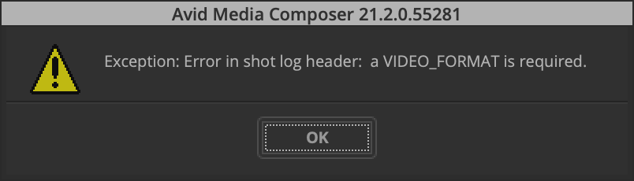

如果我们要使用Excel来批量修改ALE中的内容，要注意在Excel内修改完成后，再使用文本编辑器（VS Code、mac上的文本编辑等）来**删除Excel另外加入的TAB符**。具体操作可以看黄烁老师的文章。

（黄烁链接）

### Heading中的内容出错

Heading中内容需要与项目设置完全一致。如果不一致，则无法导入素材。

当确认DIT部门提供的ALE的Heading中内容出错时，我们可以同样可以使用文本编辑器修改Heading的内容。如果我们的项目设置是1080p/25，而DIT提供的ALE的Heading如下时：

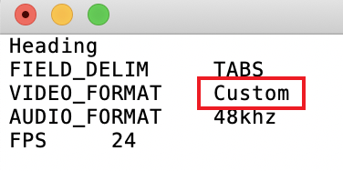

当前我们的项目分辨率并不是Custom，而是1080p，两者不符则无法导入素材。我们可以直接使用文本编辑器将其修改至符合项目设置，此处为1080。修改完成后保存ALE，即可用于导入。

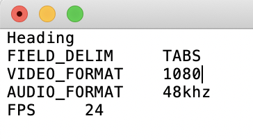

## 2.ALE中导入的素材Relink不上

此问题往往是**ALE中的Tape、Timecode与代理素材的不一致**导致的。在使用ALE创建或合并到Master Clips时，Avid MC会对比代理素材元数据中的Tape和Timecode是否与ALE中的一致，若不一致，则会显示没有素材可以被成功Relink。

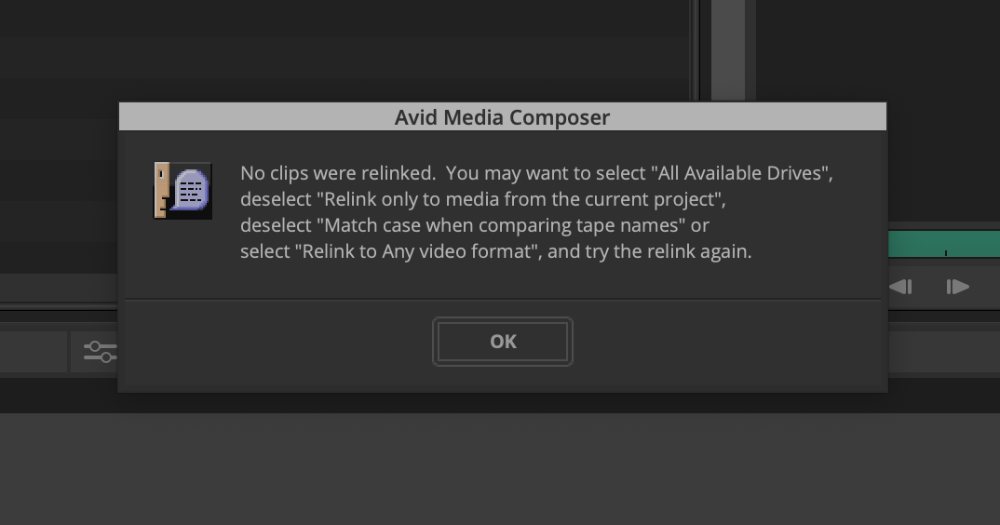

首先要明确的是，整个项目使用何种信息作Tape并不是剪辑部门能决定的。剪辑部门要负责的就是接受前期的Tape信息，并将其正确传递给下游部门。而对于Start TC来说，代理素材的Start TC应当与源素材一致，剪辑部门也要将其正确传递给下游部门。

### Tape可能出现的不一致

> **Reel和Tape**
>
> Reel，原意是卷轴，在影视制作领域则是指胶片的一卷。Tape，原意是胶带，在影视制作领域则是指磁带。
>
> 我们要理解的是，在胶片时期的剪辑工作中，我们定位一段素材的依据不是文件名（那个时候并没有“一个视频文件”的概念），而是卷名（Reel Name）和片边码（Keycode），我们给每一卷胶片安排各自的Reel Name，给这一卷内的帧安排对应的Keycode。Reel就像一套书的其中一册，而Keycode就是这册书中的页码。
>
> 而到了磁带时期，与Reel对应的概念是Tape，与Keycode对应的概念是Timecode，我们同样给每一盘磁带安排各自的Tape Name，给这盘磁带上的帧安排对应的Timecode。通过Tape Name和Timecode，我们也可以定位素材。
>
> 直到数字中间片时期，我们才真正进入基于文件的工作流程（File-based Workflow）。卷名（此时称之为Reel和Tape都可以）和时间码（通常采用Start TC）已经是一个视频文件的Metadata（元数据，关于数据的数据）。我们定位素材的依据不限于原来的卷名与时间码，也可以是文件名、文件路径。但在实际的剪辑流程中，在没有特殊需求的情况下，我们还是使用卷名和时间码来定位素材。卷名与时码贯穿在电影制作的各个流程中，是非常重要的元数据。
>
> 综上，今天当我们在说“卷名”这个词的时候，其对应的英文可能是Tape Name，也可能是Reel Name，这取决于软件本身。Avid MC与Premiere中使用的名称都是Tape，Davinci Resolve中使用的是Reel。

一般来说，我们会以Cameraroll或Filename作为卷名。以ARRI Alexa Mini摄影机举例，一条素材的文件名为A001C002_210926_RJ2Y.mxf，根据DIT部门设置的不同，其在ALE中的Tape有可能是A001RJ2Y（Cameraroll）或A001C002_210926_RJ2Y（Filename）。不论使用什么作为Tape，最重要的事情是**ALE中的Tape要和代理素材本身Metadata中的Tape相同**！

在ALE与代理素材一致的情况下，默认的Relink设置就可以成功Relink素材。但如果DIT设置不正确，导致ALE与代理素材不一致，我们的Relink就很可能失败。

举例来说，代理素材的Tape是A001R2JY，ALE中的Tape是A001C002_210926_RJ2Y（代理素材和ALE均使用Davinci Resolve生成），我尝试勾选Target(if different from Source)的选项，也无法成功Relink。手册中也没有特别清晰的说明。

我向Avid官方客服发送了邮件，对于这种情况，他们也并没有给出实质性的解决方案，但提到了在导入ALE后Bin中Source name一列为空的问题。

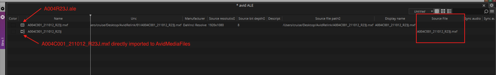

个人理解，Relink选项中的Source file name指的其实就是Bin中的Source file一栏。**而只有那些通过Import或者Link导入的素材，其Source file一列才不为空。**

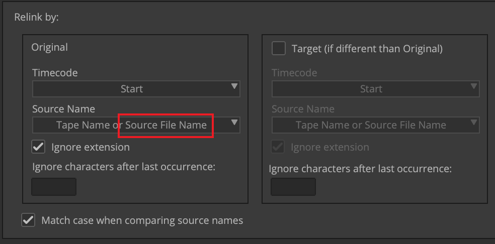

因此，使用AAF/ALE的方法导入时，Source File Name不存在。而此例中的Tape Name不一致，因此无法Relink。

在这种情况中，我们**最佳的方案就是修改ALE中的Tape**，使之与代理素材的Tape匹配（代理素材的Tape信息可以使用Davinci Resolve等软件查看）。

要修改ALE中的Tape信息，可以使用Excel，也可以Avid MC自带的Modify Clip（修改片段）功能。

要使用Modify Clip功能，需要先使Clip Offline，即需要先Unlink Media（如已经是Offline状态则无须额外操作）。

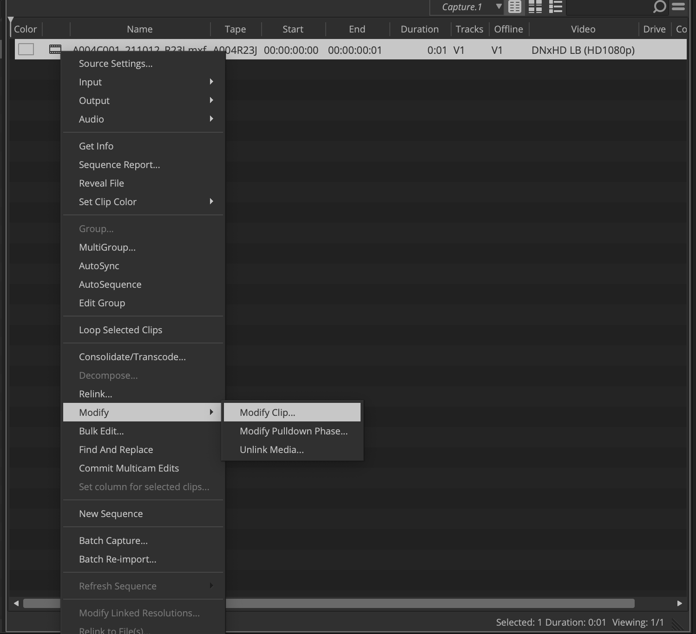

点击Modify Clip之后勾选Set Source，指定新的Tape。

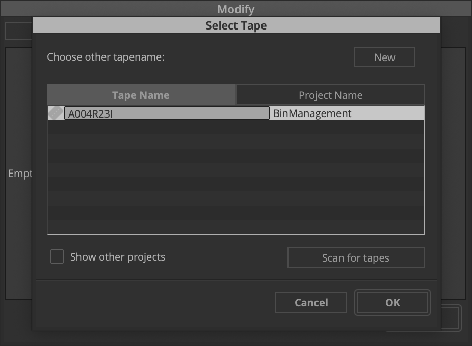

此方法适用于直接指定新的卷名，或是简单增删卷名中的几个字符的情况。

但归根结底，修改ALE只是无奈之举，重要的还是DIT部门转出的代理文件要和ALE中的匹配，并且在项目开始之初测试流程。

### Timecode可能出现的不一致

一般来说，代理素材的Start TC应该与源素材的Start TC完全一致，也和ALE中的一致。不正确的Start TC将会给后续流程带来灾难性的后果。

举例来说，源素材的Start TC是14:13:23:22，而DIT转出的代理的Start TC是00:00:00:00。这种情况下，即使Tape正确，也无法Relink素材。这种情况下**唯一的办法就是让DIT按照正确的设置重新转代理**。

## 3.Import导入的音频声道分配错误

在我们Import音频时，要根据源素材的本身的轨道分配来设定Import的选项。我们Import导入的音频可能有以下几种：

- 对白：单声道或多声道文件（Mix LR或Poly）
- 音乐：Stereo（立体声）的双声道文件
- 整片音轨：Stereo双声道的文件或5.1的六声道文件

默认的Import设置会将音频的所有轨道指认成单声道，导致立体声音频失去“立体感”。因为此时左右扬声器放出的不是各自不同的立体声的左和右，而是左右轨道混合后完全一致的“单声道”音频（左右扬声器发出的声音完全一致）。

要解决这个问题，我们需要在Import时点击Option，并切换到Audio面板。此处有两个选项与此问题无关，但同样值得注意：

- Use Broadcast Wave Scene and Take for Clip Names：勾选后使用WAV文件元数据中的场次元数据做Clipname。如19A场4次，将显示为19A/4。看情况自行选择是否需要勾选。若不勾选，则使用原来的文件名作为Clipname。
- Autodecect Broadcast Wave Moniphonic Groups：自动识别Mono的音频素材并将其组合为一个Master Clip，便于管理，一般情况下保持默认勾选即可。

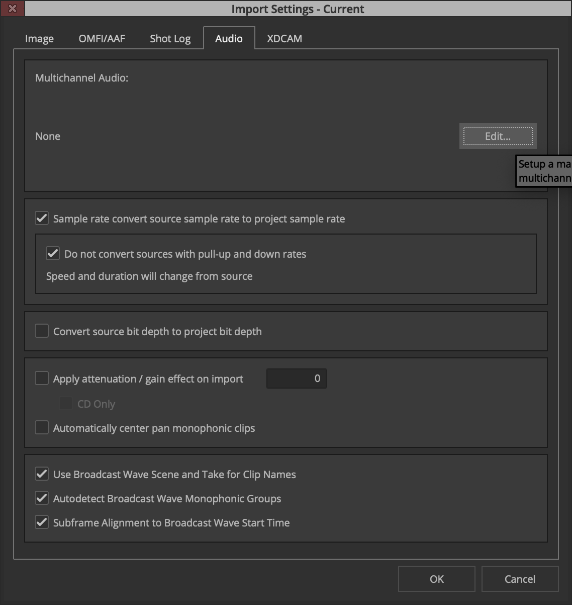

点击Edit，进入多声道音频设置。

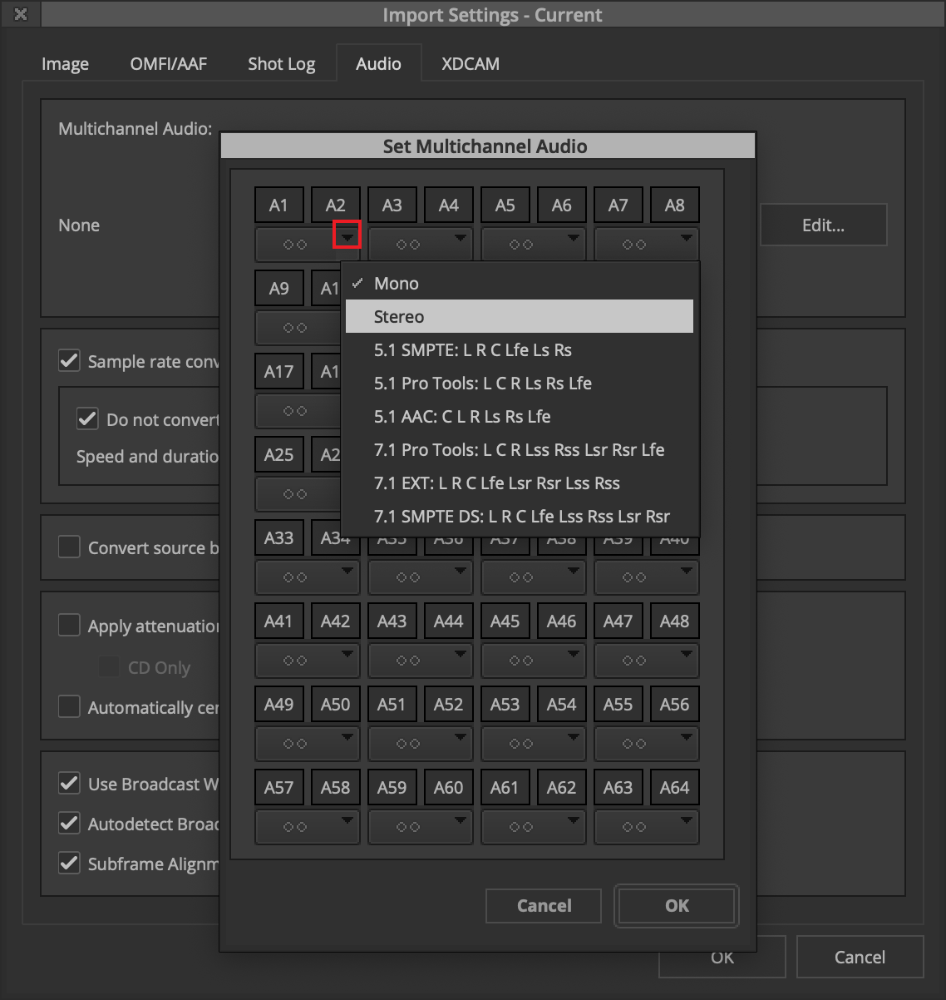

点击黑色小三角，我们可以看到关于多声道音频的轨道分配预设，我们根据当前要Import的音频的种类选择对应预设即可。

需要注意的是，当前的选择会默认应用于之后Import的所有音频。因此在Import另一种类的音频时，我们需要重新指定轨道分配，确保声道能够被正确映射。

## 4.在Avid MC的窗口中看到的素材比其他地方的“灰”

假设视频素材的色彩空间同样是Rec.709，而在Avid MC预览窗口中看到的画面比其他播放器中的更“灰”，则往往是Data Level（数据级别）的问题。

电脑显示器通常都设定在Full range，而Avid MC默认的Display Color Space默认是Legal range。Legal range的内容未经映射直接显示在Full range的显示器上时，画面看起来就会发灰（对比度下降）。此处不展开讲解Avid MC的色彩管理管线。

举例来说，DIT部门提供的代理素材是Legal range、Rec.709 YCbCr编码的MXF文件，而我们项目设置为YCbCr 709。此时素材在显示器上看起来微微发灰。理论上，我们可以对素材直接施加一个Leagl to Full的映射，素材在Avid里显示是对的，但导出后比原来对比度更高（显示和输出是两条管线），不是正确的做法。如果我们使用的是电脑显示器，那么正确的做法是右键Composer中的窗口，将Display Color Space（显示色彩空间）设定为Rec.709(full range)。

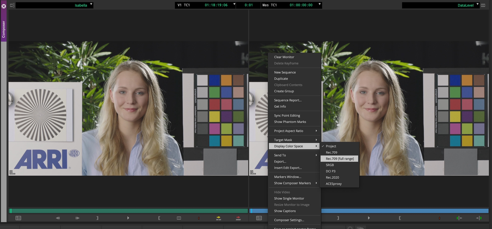

我们可以分别指定左边Source Monitor（源监视器，预览窗口）或右边Record Monitor（录制监视器）的Display Color Space。

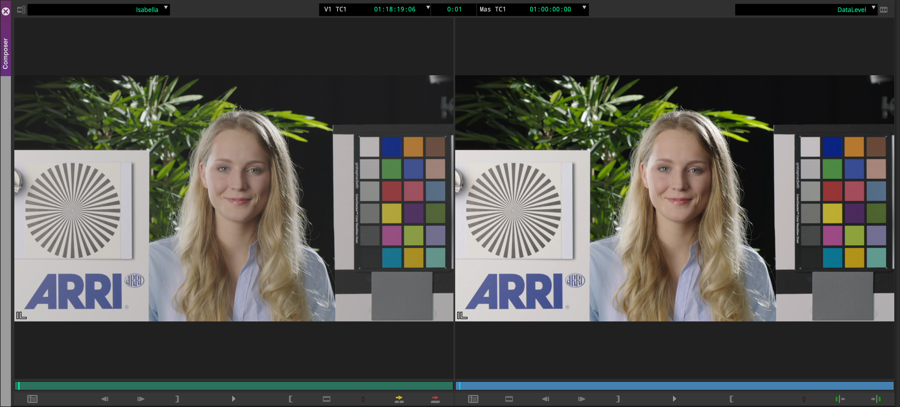

此时素材显示结果正常，最后输出结果也正常。