# Metadata与Bin的使用

Avid MC的Bin功能非常强大，可以让我们以Metadata为依据，高效地整理、标记、管理素材。

## Metadata是什么

Metadata，译为元数据，指**关于数据的数据**。**一段数据往往需要借助另一段数据来解释与描述。**以一张图片举例，数据指的是每一个像素每通道的码值，其元数据则包括但不限于：

- 分辨率与通道顺序
  - 若每行每列有多少像素是未知的，则无法正确排列像素p
  - 若通道顺序是未知的（RGB？BGR？），则无法正确传递码值到对应通道

- 色彩空间
  - 若图像色彩空间是未知的，则可能无法正确映射色彩
- 拍摄者/创建者
- 拍摄时间
- ……

上面所列举的都是元数据。元数据也有不同的种类，在影片制作的领域，元数据大致可以分为技术性元数据（Technical Metadata）和内容性元数据（Content Metadata）。

对于一段素材来说，其技术性元数据可能包括分辨率、编码、卷名、时间码、焦距、白平衡等，其内容性元数据可能包括场镜次、过保废、日夜内外景、拍摄者、备注等。

## Metadata的重要性

元数据是**连接前期、中期、后期的桥梁**，也是**后期各部门沟通协作的桥梁**。举例来说，我们需要场镜次、过保废数据来在剪辑阶段筛选素材，需要卷名与时码完成调色部门与声音部门的套底/回套，需要视效镜头号与帧号完成视效镜头的交接……在没有元数据的情况下，这些本可以由计算机批量完成的工作，最后很可能都转换为重复、繁杂的人工操作。

在大部分低成本影片、学生作业的制作中，元数据的管理往往是被忽视的。这导致了一系列如有时码器却只能手动合板、套底套不上、摄影机参数靠目测等的问题。可以说，**影片制作的过程就必然伴随着元数据的产生，制作者也必然要面临元数据的管理（而不仅仅是数据）**。

剪辑部门作为后期流程中的最上游部门，承担着**接受前期元数据**与**向后期下游部门传递元数据**的重任。

## Bin的三种视图

Avid MC中的Bin有三种视图，三个小图标从左至右分别对应Text View、Frame View与Script View。我们在不同的视图中进行的工作各不相同。

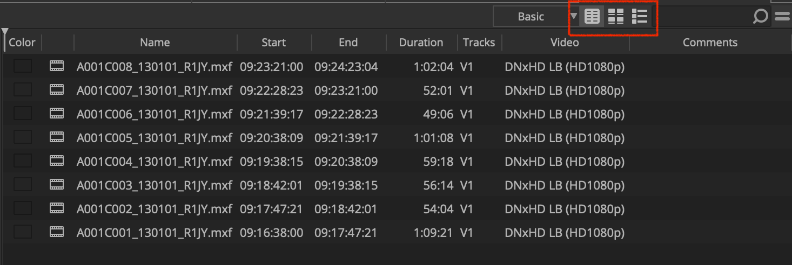

### Text View

在Text View中，我们主要完成Logging的工作。Text View本身就是一个表格，其中的Column（列）对应的就是不同的元数据。

Log，意为日志；Logging指的则是对素材添加信息。这里的信息既包含中期拍摄产生的现场信息（场记单等），也包含后期制作所需添加的信息（剪辑备注、视效镜头号等）。

#### 标题栏

我们右键点击Text View中的标题栏，会看到几个选项：

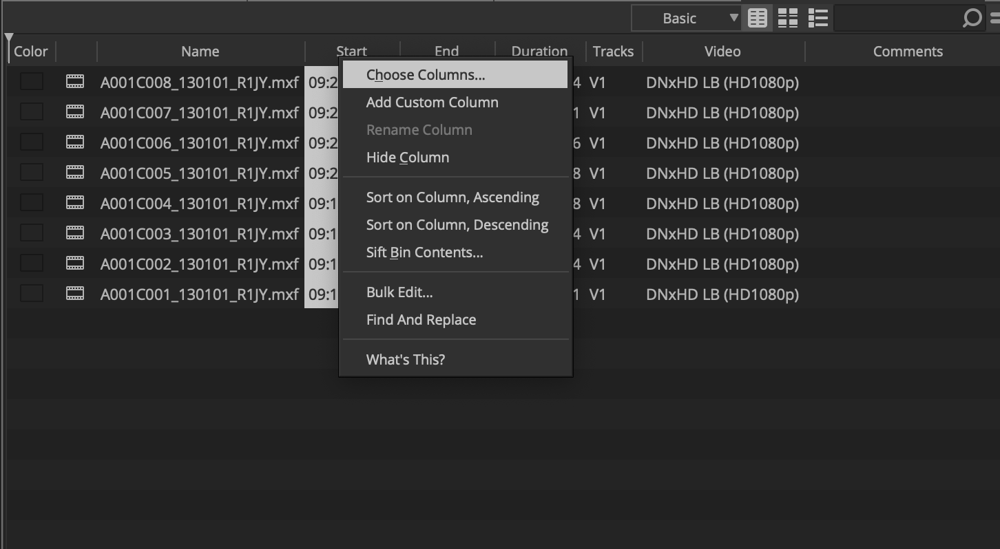

- Choose Column：选择需要显示的列。点击后会出现Bin Column Selection菜单，点击对应的Column即可切换是否显示。

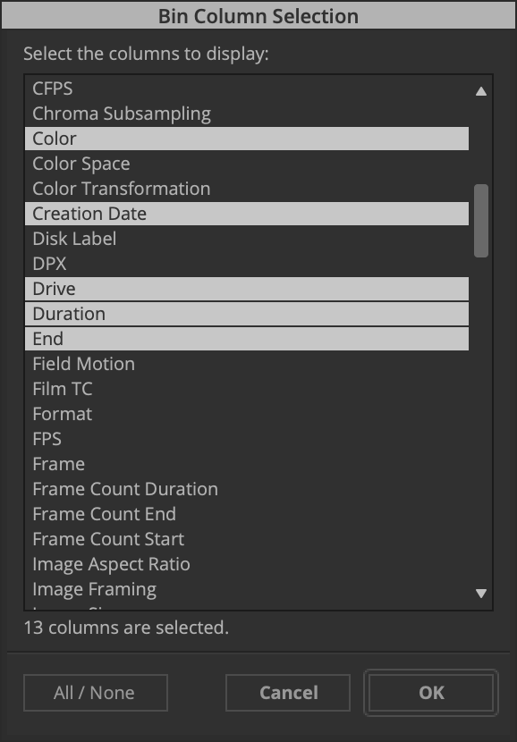

- Add Custom Column：添加自定义列。可以根据需要创建自定义列，比如为场记单上的备注创建一列Shot Log Comment。
- Hide Column：隐藏选中列。需要注意的是，隐藏列并不会删除Column中的数据，而只是将其隐藏，后续依然可以使用Choose Column将其显示出来。要真正删除Column与其中的数据，需选中对应列后点击键盘上的退格/Delete键，删除后不可恢复。
- Rename Column：重命名自定义列。

直接拖动某一列的标题栏，可以改变其布局顺序。

#### 编辑列中的内容

我们可以编辑列中的数据（技术性元数据往往不可修改），方法是直接点击对应单元格后输入对应内容。举例来说，我们可以为Master Clip添加场镜次数据。

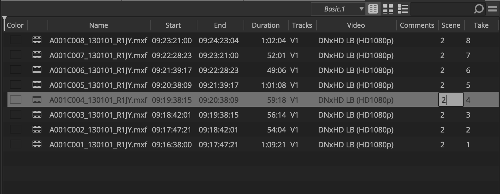

#### 使用列布局预设

点击红框中的下拉菜单，可以选择几种预设布局，也可以将当前布局存成预设。举例来说，为了方便我们手动合板，我们可以将Tape、Scene、Shot、Take、Tracks的列拖到一起，点击下拉菜单中的Save as，将其命名为Manually Sync，方便后续调用。

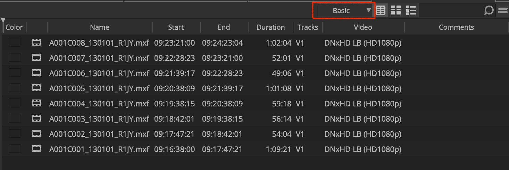

#### 按照标题栏排序

双击某列标题栏，即可使Bin中项目按照当前标题栏升序/降序排列。和右键标题栏后选中Sort on Column,Ascending/Descending效果相同。

#### 设定Clip的颜色

右键Text View中的Color列小方框，可以设定Clip的颜色，便于筛选。

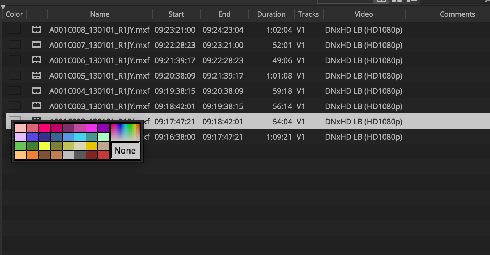

#### 复制列内容

点击标题栏中需要复制的列，点击Command+D（Windows上的Ctrl+D），或是点击顶部菜单栏Edit> Duplicate，即可在弹出的菜单中选择要粘贴到的列，再点击OK即可完成复制。

### Frame View

在Frame View中，每一个Clip都会以缩略图显示，方便我们直观地查找素材。

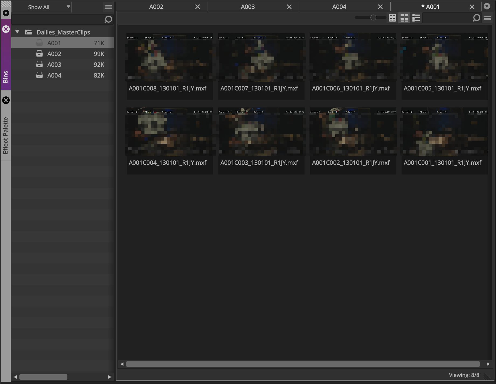

在Frame View中，我们主要进行查看素材和排列布局的工作。

#### 放大与缩小

在切换到Frame View后，Bin的上方会出现一个滑动条。拖动该滑动条可以改变Frame View中缩略图的大小。

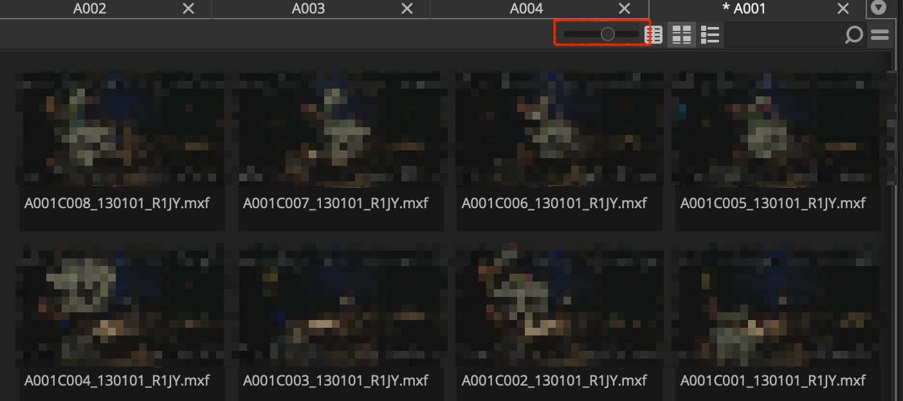

对应的放大快捷键是Command/Ctrl+L，缩小快捷键是Command/Ctrl+K。

#### 填充窗口

当Frame View中的缩略图大小变化时，缩略图布局并不会自动变化。

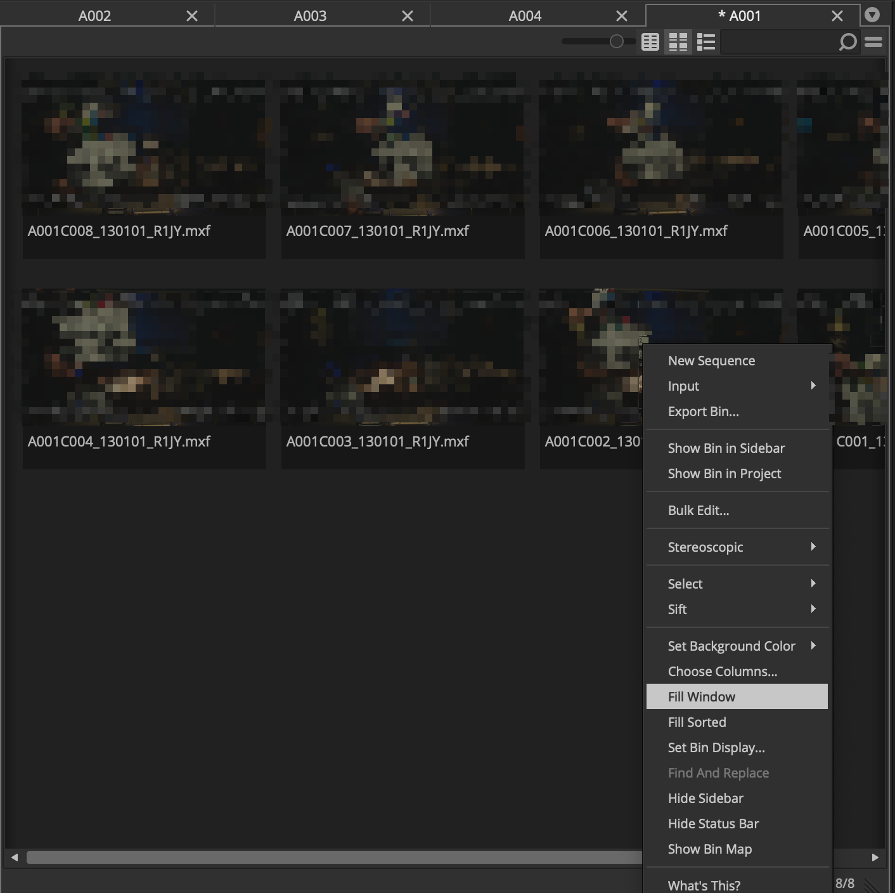

举上图为例，放大缩略图后，第四列已无法完整显示。此时，我们右键Bin中空白处，点击Fill Window选项，即可让缩略图与隐形网格对齐，并随窗口大小排列。

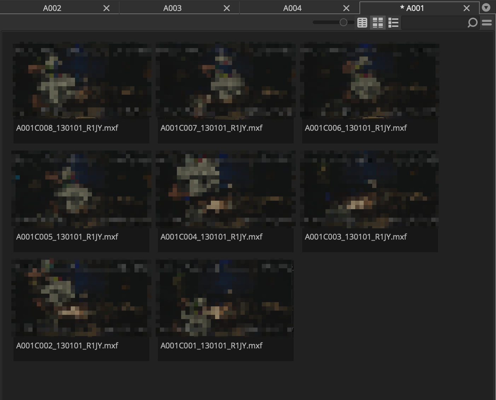

点击Fill Window下方的Fill Sorted选项，可使Frame View中的缩略图**按照Clip在Text View中的顺序**排列。

#### 自由拖拽

我们可以自由地拖拽Frame View中的缩略图，使之按照我们想要的布局排列。

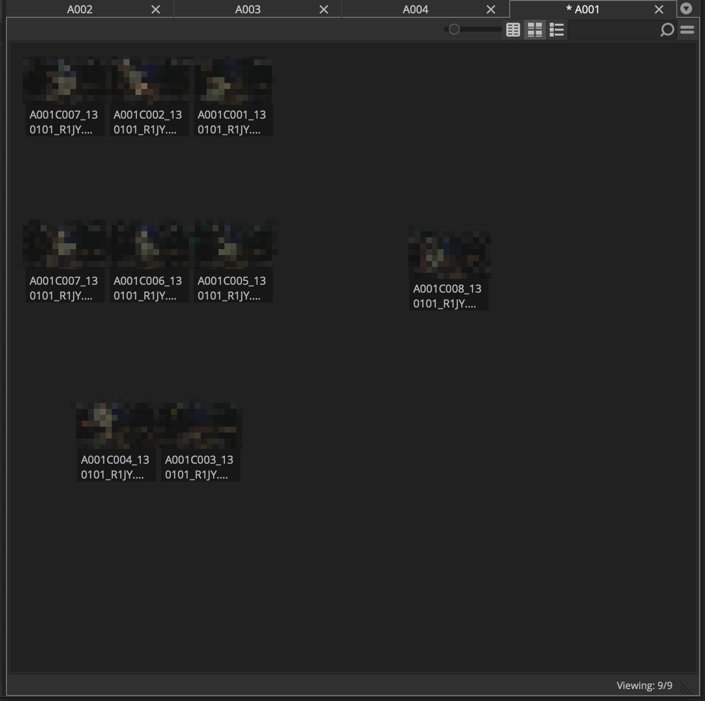

一些剪辑师会有将不同机位、景别的素材放在Frame View中不同位置的习惯，利用好这个功能，我们可以提高自己挑选素材的效率。

#### 对齐网格

Frame View中有一个隐形网格，我们可以选择让缩略图沿网格对齐。

选中Clip后右键，并点击Align and Fill（或者点击顶部菜单栏Bin>Align and Fill），即可选择Align Columns或Align Selected。其中Align Columns会对齐所有缩略图到网格，而Align Selected只对齐选中的部分。

#### Bin Map

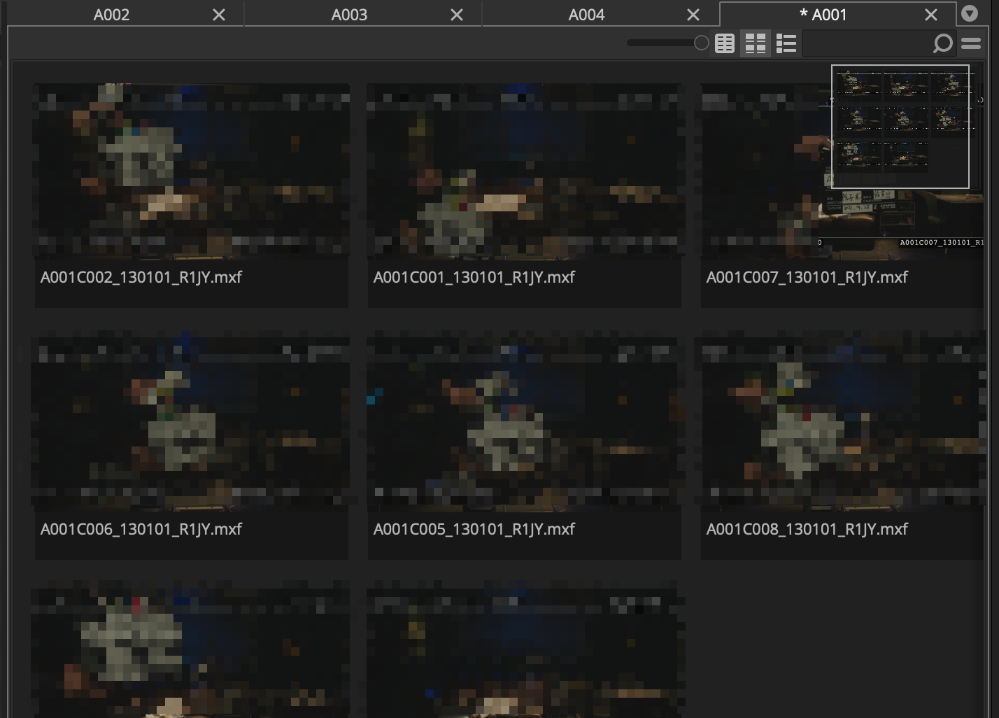

默认情况下，切换到Frame View并放大缩略图后，右上方会有一个Bin Map。直接拖拽Bin Map中的白色方框，即可将我们导航至Bin中的不同位置。

Bin Map可以帮助我们在Bin中素材较多、Frame View布局较大时快速定位对应的Clip。

#### 播放素材

选中Clip的缩略图，点击键盘上的J、K、L，即可分别使选中Clip在缩略图中倒放、暂停、正放。在缩略图中将一个片段播放至特定帧将有助于我们直观地查找素材。

### Script View

Script View综合了Text View与Frame View，能让我们在查看文字信息的同时也查看缩略图。因此，Text View中复制列、列布局，Frame View中的缩放、移动、播放缩略图等诸多功能在Script View中都是可用的。

#### 输入备注

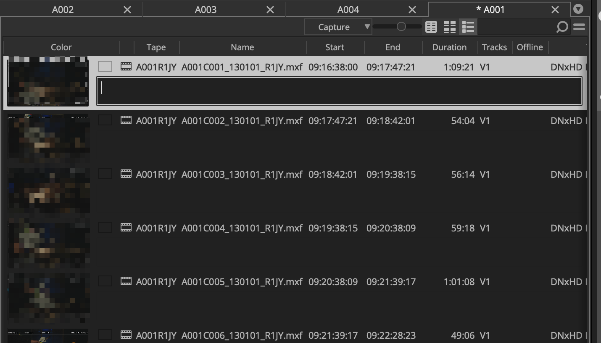

选中Clip后点击缩略图右方的文本框，即可为选中的Clip添加备注，输入的内容对应着Comment这一列数据。

需要注意的是，此处输入的评论会覆盖之前已经存在的Comment列。如果你导入的ALE中带有前期部门加入的Comment，则需将其复制到新列中，防止被覆盖。

## Bin的内容查找

Avid MC中搜索与筛选的方式多种多样，此处介绍三种。

### **搜索框查找**

在搜索框中输入内容后，Avid MC以当前选中的列（若未选中则是Name）为依据，搜索Bin中的Clip。

### **内容筛选**

在Bin空白处右键，选中Sift>Sift Bin Content，即可在弹出菜单中设定条件，以筛选Bin中的Clip。

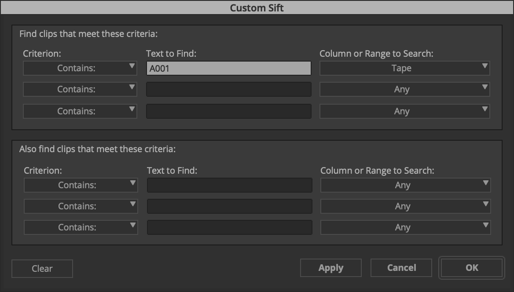

设定筛选条件后，右键菜单的Sift>Show Sifted/Unsifted即可切换显示已筛选或不筛选的Clip（不满足条件的Clip没有被删除，只是被暂时隐藏）。

#### **Find**

点击Command/Ctrl+F（或是选择顶部菜单栏Edit>Find）后，可以使用Find功能。

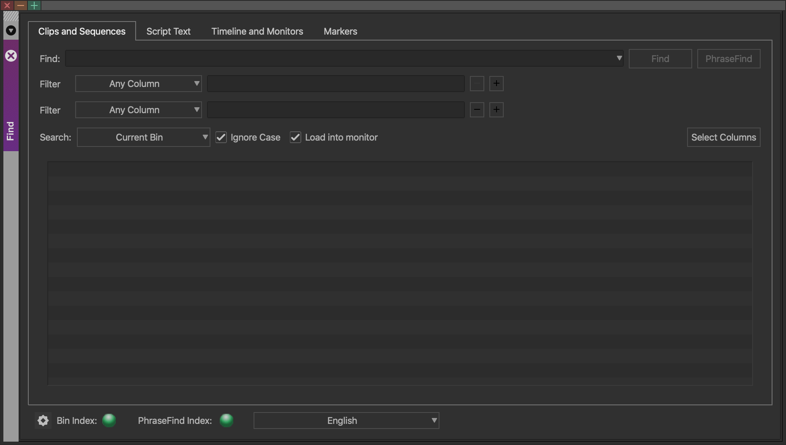

Find功能非常强大，可以查找素材与时间线，甚至可以查找时间线上的Marker、特定某句台词等。

本教程不展开讲解Find功能，因为搜索框+筛选已经足够完成大部分搜索工作，感兴趣的读者可以自行查阅手册。

## Bin中其他实用功能

Bin中的有许多非常实用的小功能，以下列举几项，但不展开讲解。

#### Bulk Edit

Bulk Edit意为批量修改，可以用于以模版化的方式批量修改某列数据。举下图为例，此处将所选Clip的Name替换成"场-次"。

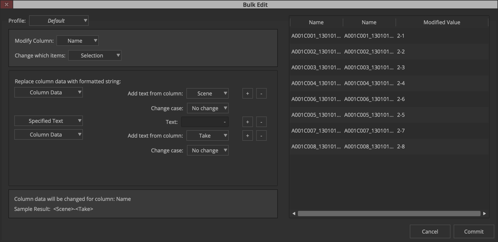

#### Bin Background Color

右键Bin中空白处，选择菜单中的Set Bin Background Color，即可为当前Bin指定背景色，方便区分不同的Bin。

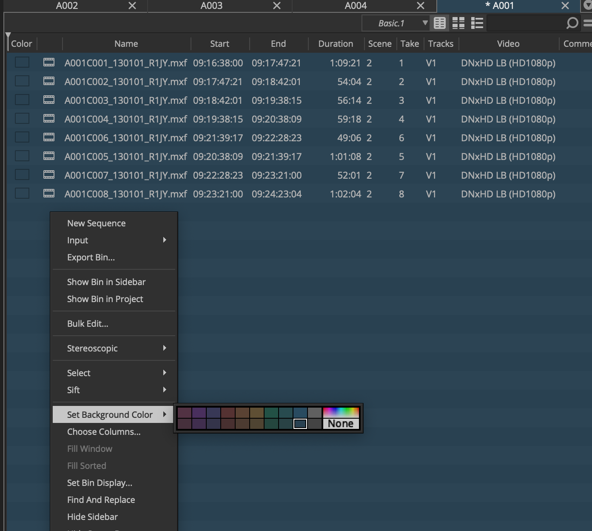

#### Bin Fast Menu

我们可以点击搜索框右方的形似等于号的图标，即可呼出Bin Fast Menu。其中的选项与右键呼出的的相同。

（小提示：此处Bin名称旁边的*星号表示当前Bin的修改还未保存。）

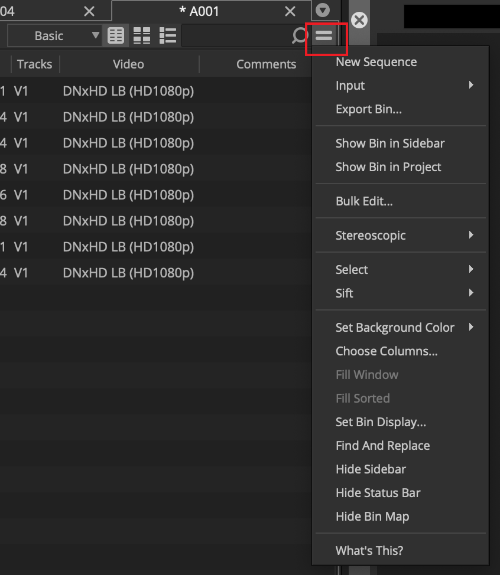

#### Status Bar

Bin下方的状态栏提供了简要的当前Bin的信息。切换其开关的方式是右键菜单>Show/Hide Status Bar。

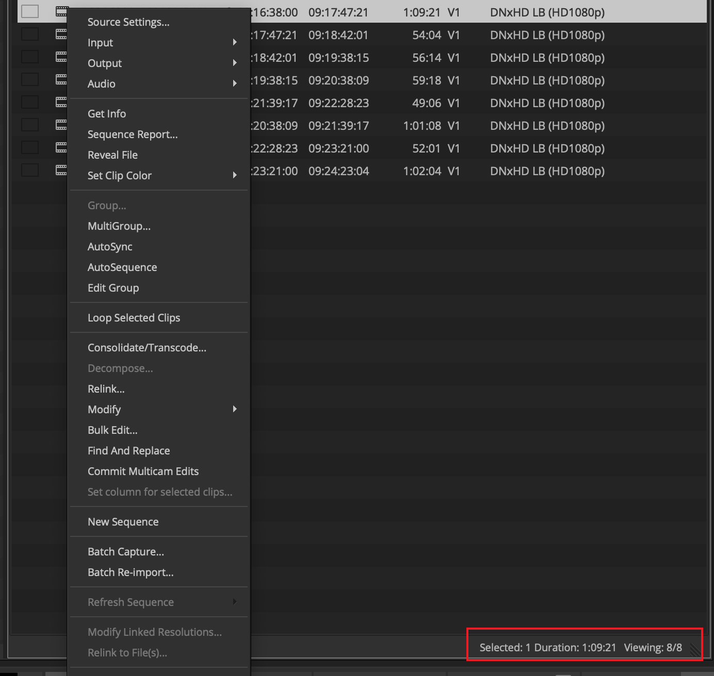

#### Bin Setting

Bin的偏好设置可以通过顶部菜单栏Windows>Bin Setting来更改。

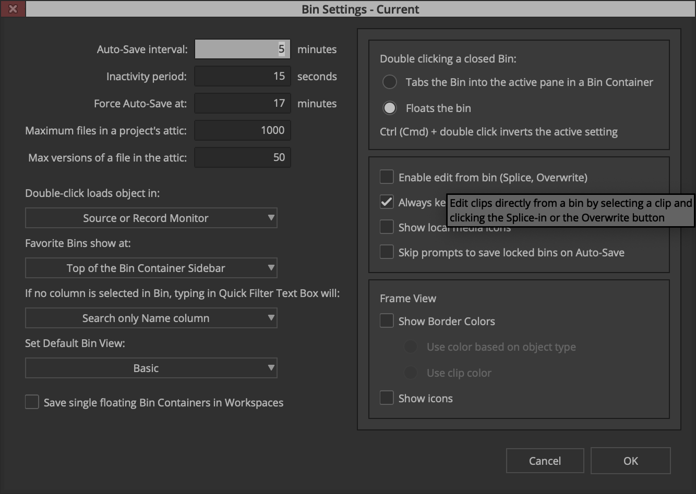

一般情况下，默认设置无需修改。但可以根据需求与个人喜好进行调整。如：

- 减少自动保存的时间间隔：将Auto-Save interval的数值改小
- 设定默认的Bin View：将默认Bin View设置成自定义布局，方便查看信息
- 设定双击Bin后的行为：修改为双击Bin后以浮动的方式打开

#### Float Bin

将Avid MC中的面板变浮动窗口的好处可以将其自由拖拽到任意位置，而不受限于软件本身的布局。

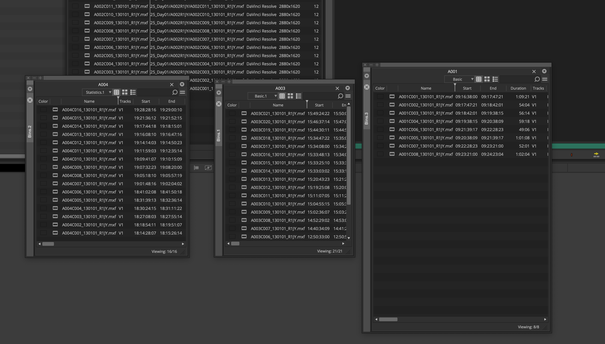

举Bin为例，对于Bin Container标签页中的Bin，鼠标左键按住Bin的标题，拖拽到Bin Container中的边缘即可实现“分屏”效果；将其拖拽到其他位置（无绿框出现），即可将其浮动。

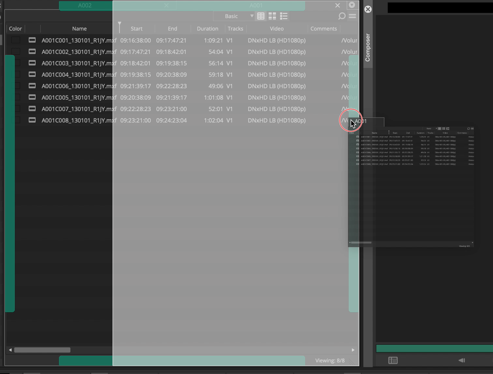

#### 最大化

点击Bin Container左上角的加号，即可将Bin最大化，从而方便查看。

## Bin的管理

当我们使用Bin时，应该按照其中存放的素材种类将其分类，并存放在不同的文件夹中。一个科学的Bin管理方式有助于我们更好地检索素材。

### 创建文件夹

我们可以将不同的Bin放在一个文件夹下。操作方法如下：

右键Bin侧边栏中的空白处，点击New Folder。

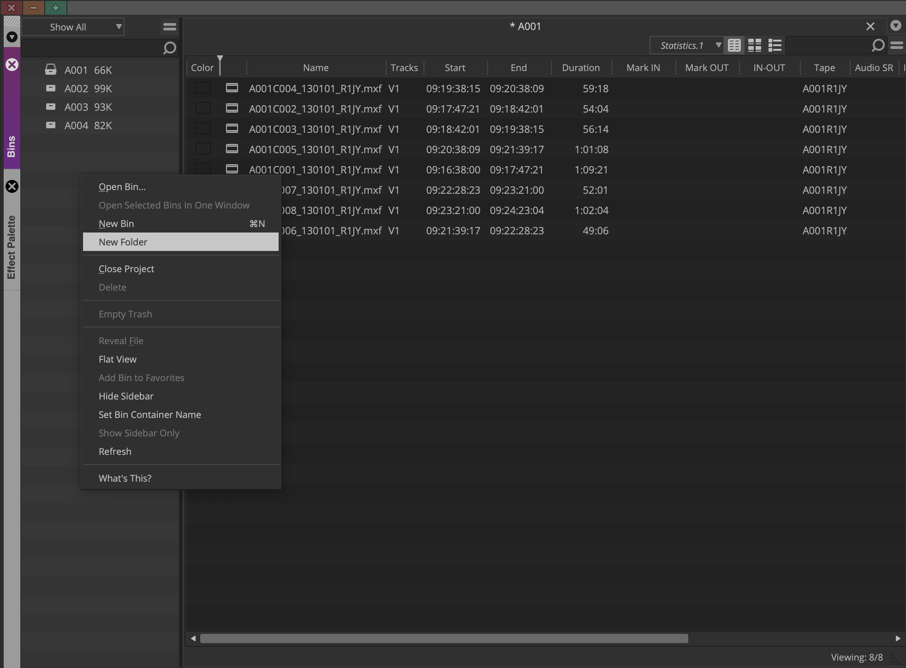

举例来说，此处我们可以创建一个新的文件夹，并将其命名为`Dailies_MasterClips`，用于存放代理素材Master Clip的Bin。创建完成将对应的Bin拖拽到这个文件夹中。

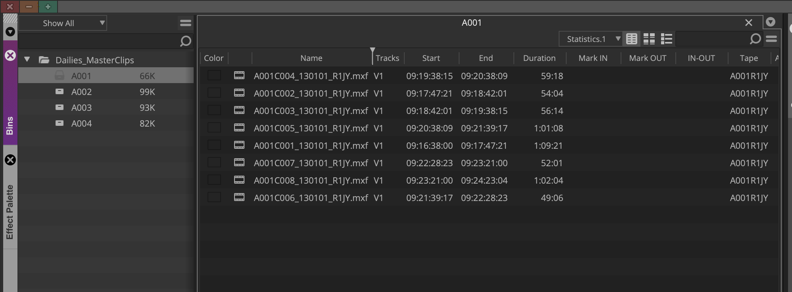

同理，我们也可以创建存放音频Bin、存放时间线Bin、存放字幕Bin等的文件夹。需要注意的是，文件夹中可以存放文件夹或Bin，而Bin中不能存放Bin（Bin不能嵌套），也不能存放文件夹。

每一个Bin Container中的文件夹都对应外部储存中的一个文件夹。

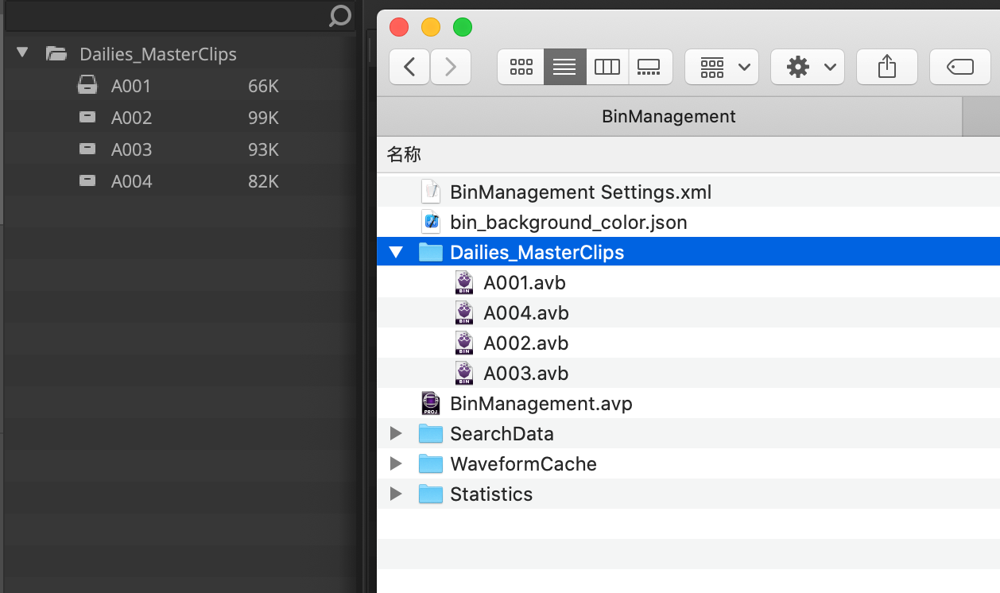

在使用文件夹管理Bin时，我们不仅要考虑到目前有哪些Bin需要分类，也要考虑到后续可能会出现的Bin。更重要的是按照同一个思路一以贯之，否则在后续检索时就会出现麻烦。

### 删除Bin及其中内容

我们选择一个Bin或文件夹，点击键盘上的Delete键，选中的项目就会被移动到Avid MC的Trash(回收站）中。

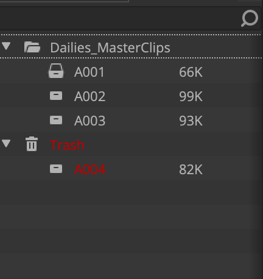

当我们误删Bin或文件夹，将其从Trash中拖拽出来即可恢复。

需要注意的是，在右键Empty Trash（清空回收站）后，Bin中一切内容都会被彻底删除，无法恢复。

### 科学的Bin层级结构

在实际生产中，还是需要具体问题具体分析。此处给出一张截图作为参考。此图出自Steve Hullfish的一篇文章，原文链接和黄烁老师翻译的版本都在下方。

https://www.provideocoalition.com/full-workflow-for-editing-the-1-feature-film-war-room/

https://mp.weixin.qq.com/s/CpcuBcTlInGAYYM9IPoj9A

（推荐大家多看看黄烁老师的公众号**后期骗局**，干货满满）

- _EDIT：存放不同版本的时间线
- DAILIES ORIGANIZED PER SCENE：以场为依据分类存放合板得到的Subclip
- DAYS-AS DELIVERED FROM DIT：以拍摄日为依据分类存放DIT交付的代理素材的Master Clip
- MISCELLANEOUS：存放各种东西，字幕、图形等等
- MUSIC AND AUDIO：存放音乐和同期声
- SCRIPTS：存放剧本

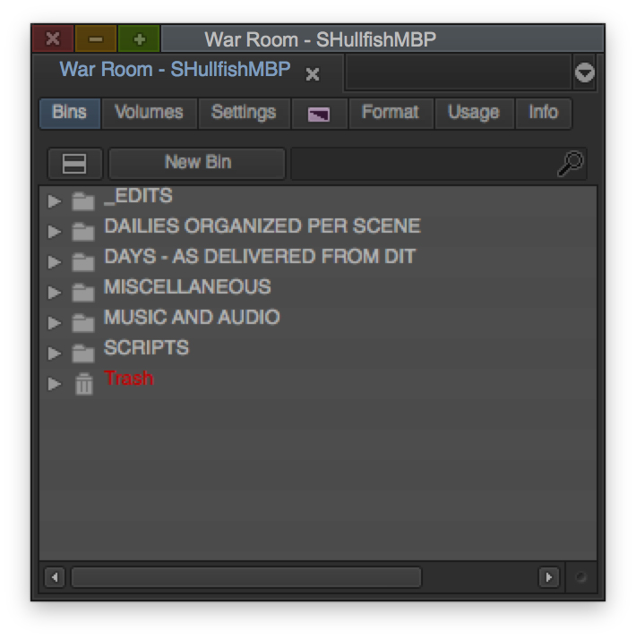

本篇教程算是抛砖引玉，要完全写好Avid MC中Bin的用法，怕是再写几篇也不够。但上面提到的技巧已经足以完成大部分日常工作。
