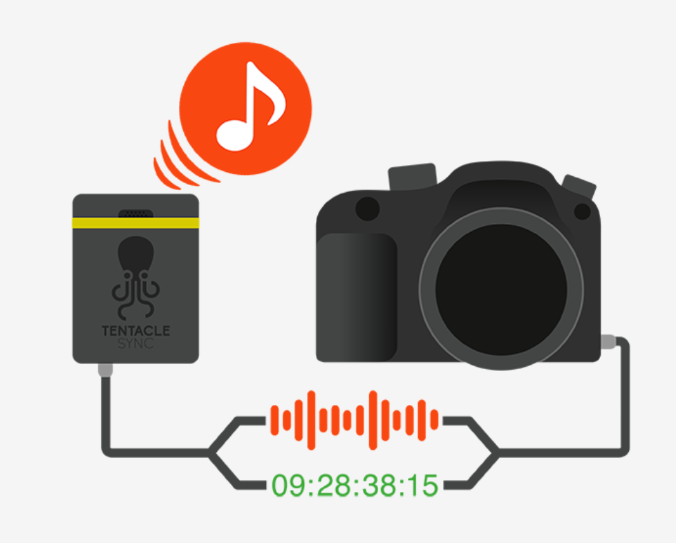
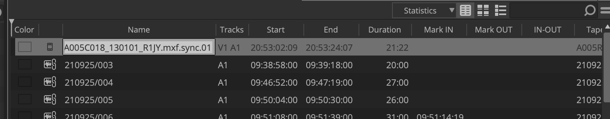

## 合板是什么
合板，指的是将视频与音频素材同步（Synchonize）并绑定的过程。在专业影视制作中，**现场声音与画面往往都是分开录制的**。摄影部门负责使用摄影机录制画面，声音部门负责使用录音机录制声音，最后分别得到视频文件与音频文件。当素材交付到剪辑部门之后，剪辑助理需要将音视频同步并绑定，完成合板的操作。

在本节课程中，我们稍微钻牛角尖，从剪辑部门的角度，分同步与绑定两步来谈谈合板这件“小事”。

## 同步的依据

### 场记板

利用场记板进行手动合板是最传统的合板方式。其同步原理是：场记板合上的时刻在音频波形上呈现为一个“尖峰”，因此将**音频波形中的“尖峰”**与**画面中场记板合上的第一帧**对位，就可以认为成功同步。

在规范的制作流程中，如无特殊情况，**摄影机画面的第一帧应当是完整清晰的场记板**。这能让剪辑人员在缩略图中直接看到场记板上的场境次信息，方便对素材做Logging。

利用场记板的方法成本较低，但实际制作中，许多制作团队甚至连板都打不好，场记板部分出画也时有发生，更别说第一帧的是完整清晰的场记板了，这些都是不够专业的表现。

手动根据场记板同步百余甚至几百条素材是工作量较大的重复操作。而不论是场记板没有完全入画，还是没有录制到打板时刻的声音，都会给我们同步素材带来许多不便。

### 波形

部分摄影机可以通过内置或外接的机身麦克风收音，从而在录制画面的同时录制声音，视频的音画已经同步。

在专业制作中，出于录制质量、录制规格等因素考虑，摄影机内录的音频往往不直接用于最后的制作。尽管如此，摄影机内录的音频依然有其用处，既可以作为一份相对质量较低的音频备份，也可以作为基于波形同步的参考。其同步原理是：在**条件可控**的情况下，**摄影机内录的音频**与**录音机录制的音频**应当具有相似的波形，通过软件自动对比分析将二者的波形对位，也可以认为成功同步。

在实践中，基于波形的同步并不够可靠。因为摄影机录制的音频和录音机的可能差别较大，软件无法识别并同步。即使二者波形足够相似，可能也无法实现**精确到帧的完全匹配**，依然需要逐条调整，带来了额外的工作量。

### 时间码

在前面的专栏当中，我们已经谈过时间码的概念。那么时间码的来源是什么呢？

简单地说，不管是摄影机还是录音机，其内部微处理器中都有一种叫做**晶振**的电子元件，能够提供高精度的时钟信号。这个时钟信号为摄影机、录音机提供了采样时刻的参考，使其以恒定而准确的间隔记录信号。时间码的来源就是机器内部的晶振。其同步原理是：通过取一具有高精度晶振的设备作为主时钟（往往是时码器），使其他设备与之同步，所有设备在同一时刻记录的素材便具有相同的时间码，为同步提供准确可靠的参考。

（似乎又不小心在Avid教程里讲了DIT的内容。）

值得注意的是，素材的时间码并不一定在文件的元数据中。一些摄影机没有提供TC IN（时间码输入）接口，我们将时间码以音频的形式输入并记录在摄影机素材的音频轨道中，后期提取出时间码后再进行同步。我们称这种时间码为辅助时间码（Auxiliary TC）。

（一个思考题：DIT和剪辑人员都能提取这种时间码，应该由谁来提取呢？）

作为剪辑人员，我们需要知道的是：时间码可以帮我们迅速同步大量素材，提供极大的便利。但实际制作中，基于时间码的同步也不是万能的。时码器需要每隔4-6小时校准，否则会有偏差；时码器与摄影机/录音机的连接可能中途断开导致不同机器时间码不一致；通过音频输入时码导致其他音轨被串扰……

总而言之，基于**场记板**的和基于**时间码**的同步方式是当前主要应用的两种方式。

> 一些制作团队为了拍摄速度，在有时码器的情况下就不打场记板，这实际上是个坏习惯。如果时码出错，又没有场记板提供参考，更没有机内参考音，只能是同步个寂寞了。

## 绑定的方式

在同步之后，我们还需要将素材绑定，得到完成音画同步的新片段。这里所说的绑定只是一个统称，而不是具体的功能名称。如果你有剪辑软件的使用经验，也许会想到“合并剪辑”（Premiere）或是“复合片段“（达芬奇、FCP），Avid中也有对应的操作，后文会提及。

需要注意的几点是：

- 绑定得到的新片段要继承原有片段的元数据
- 绑定的过程应该能够过批量完成
- 绑定后的新片段要便于使用

合板这件“小事”，如果没有做对做好，不仅会对剪辑部门造成困扰，也会对下游部门特别是声音部门带来麻烦，包括但不限于：导出的AAF中音频元数据丢失、AAF中音频错位……

在Premiere、Davinci Resolve等软件当中，都有合板的功能，但是它们绑定出的“复合片段”往往会导致丢失音频元数据。相对而言，Avid MC的AutoSync（自动同步）是够用并且符合工作规范的。

## Avid MC中的AutoSync

利用Avid MC中的AutoSync，我们可以将音视频素材的Master Clip同步，并以画面长度为基准掐头去尾，再绑定，最后得到Subclip（单机位）或是Group Clip（多机位），完成合板的过程。AutoSync支持我们以入出点、波形或是时间码的方式同步。

本节课程只讨论单机位合板，也就是生成Subclip的情况，需要了解Group Clip的读者请自行查阅手册。

AutoSync不能跨Bin同步素材，我们要先将需要合板的素材放在同一个Bin中。此处，我们新建一个名称为Sync的Bin，用于合板。将第一天所有的Master Clip都拖拽到Sync Bin中。(不一定要拖拽，也可以选择复制Master Clip，请查阅手册）

我们分不同的同步方式来演示AutoSync的操作。

### 场记板

在开始同步之前，我们需要分别在音频与视频的Master Clip上打标记点。视频的标记点打在场记板合上的第一帧，音频的标记点打在板的位置上。

> #### 一些简单的快捷键教学
>
> - J，K，L：倒放，暂停，正放
> - 空格：切换播放和暂停
> - I，O：打入点（Mark In），打出点（Mark Out）
> - D，F：清除入点，清除出点
> - G：同时清除入点与出点
> - 1，2（非小键盘）：往头8帧，往尾8帧
> - 3，4：往头1帧，往尾1帧
>
> 以上这些快捷键可以帮助你提高操作效率，请在源监视器中熟悉这些快捷键的使用。

根据我们之前Logging输入的场镜次元数据，或是场记单记录的文件名信息，找到目标素材对应的视频、音频的Master Clip。此处我选中的是1场2镜3次。双击视频素材将其加载到源监视器中，找到场记板合上的第一帧，点击I，打一个入点。

双击音频素材，同样找到对应的点，打一个入点。

> 你可能会碰上这样一种情况下：双击Master Clip后，源监视器中没有音频波形的显示，很难找到板的位置。事实上，Avid MC可以切换下方轨道的显示。
>
> 在软件底部的菜单栏中，点击下图红圈中的小图标，即可切换轨道显示，
>
> 

> Avid MC的默认轨道设置不显示音频波形，需要在轨道快捷菜单中设置，将Waveform打开。
>
> 
>
> 如果觉得轨道大小不合适，可以点击Command(Ctrl)+K/L缩放轨道；觉得波形太小，可以点击Command(Ctrl)+Option（Alt）+K/L缩放波形（而不改变音量）。

选中两个Master Clip（按住Command(Ctrl)点选即可多选）并右键，点击菜单中的AutoSync。

在弹出的菜单中，选中“Mark In”，点击OK。软件会以我们打的入点为依据，同步并绑定素材。

可以看到Bin中出现了一条新的Subclip。

双击该Subclip，检查是否正确同步。检查无误，我们就完成了一条素材的合板。

### 波形

此方法需要视频的Master Clip有同期音频的音轨。我们同样用选中对应的两条素材，右键菜单中的AutoSync。在弹出的菜单中选中Waveform，点击OK，等待软件完成对音频波形的分析。

分析完成后，可以看到Bin中出现了新的Subclip。我们同样检查是否正确同步，检查无误，即完成该条素材的合板。

该方法可靠性不强，并且实践中很少使用，因此不展开叙述。

### 时间码

#### 内嵌在元数据中的时码

此处代理素材的元数据中已经有正确的时间码信息，无需再另外提取。我们Command(Ctrl)+A全选当天所有素材，右键点击菜单中的AutoSync，并在弹出的菜单中，选中“Timecode”，点击OK。

可以看到Bin中出现了批量合板得到的Sublip。

需要注意的是，在利用时间码批量合板后，我们依然需要检查素材是否正确合板，是否有遗漏。没有被匹配的Master Clip会在AutoSync后被自动选中，我们可以设定右键设定其Clip Color为红色，以示区分。

如果觉得一次同步一天所有素材太乱，也可以分机位、分场景同步。

> #### 一个小技巧
>
> 为了方便检查，我们可以再次全选当天所有Master Clip，右键，选中菜单中的AutoSequence，就会得到一条涵盖当天所有素材的时间线.
> 
> 
>从中便能直观看到哪些素材合上板，哪些没有。
>
>

对于那些没有同期声的但又不是废条的素材，我们也需要将其掐头去尾，做一个Subclip。具体方法为：将源监视器左上角的Make Subclip的小图标拖拽到Bin中，即得到其Subclip。

#### 音频轨道中的辅助时码

当我们需要提取音频轨道中的辅助时码时，选中需要提取辅助时码的Master Clip，点击顶部菜单栏Clip>Read Audio Timecode。

在弹出的菜单中，设定几个选项：

- Audio Timecode Source：该选项设定的Audio Track会被用于读取音频辅助时码，根据实际情况设定。
- Destination Track：该选项设定的TC Track会储存提取出的辅助时码（同时体现在Bin中的Auxiliary TC列中），默认选择Auxiliary TC1。
- Fill undecodable Frames：自动在无时码的间隔中填充有效时码，默认勾选。

点击确定，等待软件分析完成后Auxiliary TC1列中即出现提取出的辅助时码。

后续AutoSync的步骤与内嵌时码的基本相同，但是要将所有Master Clip的TC都复制到Auxiliary TC的列后，再使用AutoSync。要注意将Sync Clips Using的选项设定为对应的Auxiliary TC。

> 从流程的角度来说，音轨中的辅助时码应该由DIT来提取，并将提取出的时码写入代理素材的元数据。
>
> 假设一个项目有多种摄影机的素材，其中一部分使用内嵌时码，一部分使用音轨中的辅助时码。如果由剪辑部门来负责时间码的提取，那么不可避免的两个问题就是：
>
> - 一部分Master Clip的有效TC在默认的Start TC列，另一部分Master Clip的有效TC在Auxiliary TC列。而剪辑软件中的合板、导出EDL等的操作往往都只能使用其中一列（而不能一部分素材使用A列，另一部分使用B列），也就意味着要将不同的TC都复制到一列中，造成许多不便。
> - 部分剪辑软件没有提取音轨中辅助时码的功能，如Premiere、FCP系列。
>
> 相比之下，DIT在现场对不同摄影机、录音机的时码信息有更全面的掌握，DIT软件也都有提取音轨中辅助时码的功能。由DIT负责时码的提取并将其写入代理素材的元数据中，剪辑部门就可以只关注Start TC，这显然是普适性更强的选择。

### 其他选项

这里对AutoSync中的其他选项稍做解释：

- Keep audio on clip with video：选择是否在生成的Sublip中保留视频Master Clip的音轨，默认关闭表示不保留。如果需要保留，可以设定需要保留的音轨。
- Include audio from audio-only clips，选择音频Master Clip中的哪几轨会被用于Subclip中，应确保目标音轨都被囊括。
- Collapse Audio Tracks：塌缩音轨。勾选该选项后，生成的Subclip中不会出现空轨道。举例来说，音频Master Clip有8轨，其中A2、A4、A6、A8没有音频，如勾选该选项，生成的Subclip中A1-A4对应原有Master Clip的A1、A3、A5、A7。

### 后续操作

在合板完成后，我们可以将得到的Subclip使用Bulk Edit批量重命名，并按场分类存放到不同的Bin中，便于后续使用。

## 两点思考

### 谁来合板？

在实际工作中，合板的人可能是DIT或剪辑助理。尽管都是合板，但因为他们处在生产流程的环节不同、所使用的工具不同，往往也有不同的结果。

最直观的体现就是元数据。许多DIT不懂流程，往往以破坏性的方式先合板、出代理，而并不考虑其中元数据丢失的问题。举例来说，DIT在达芬奇中合板，只将带有音轨的代理文件交付给剪辑部门。在这个过程中，声音素材的元数据（Soundroll、TC、Comment等）全部丢失了，给下游部门造成了潜在的麻烦——这是规范的流程当中不应出现的事情。

特殊情况下，如果非要以这种合板后出代理的方式交付，DIT也应该同时从原始素材导出元数据表单（ALE、CSV），和代理素材一同交接给剪辑部门。

事实上，Silverstack等软件提供了一种非破坏性的合板方式。DIT交付未合板的代理素材与音频素材，以及描述素材合板状态的文件（通常是XML）。剪辑部门导入这个文件并链接素材，做到快速合板与保留元数据一举两得。（但这种方法并不是完美的，链接的过程也有许多变数可能导致链接失败。）

因此，从元数据，特别是音频元数据的角度考虑，合板应该由剪辑助理负责，方能在最大程度上确保元数据的完整传递。而在那些不太需要元数据的场合，如导演需要在iPad上回看当天素材的小样，由DIT直接合板转码亦无妨。

### AutoSync好用吗？

在上文的讨论中，我们把将合板分成同步和绑定两步来讨论，从中可以看出了AutoSync的优点。

在同步上，它提供了几种丰富的同步依据，能够满足绝大部分需求；在绑定上，基于Subclip的绑定方式可以很好地继承原有元数据，也便于使用。这些相比Premiere、Davinci Resolve来说，都是优点。Premiere与Resolve的合板都有许多的坑，有机会的话后续再写篇文章单独说说。

但能说AutoSync足够好用吗？起码我不这么觉得。它在用户逻辑上还有很多可以优化的地方：比如允许跨Bin进行同步从而减少反复拖拽，比如以更清晰的方式展示同步的状态从而减少人工排查，比如允许指定目标Subclip从而有更清晰的流向……

尽管如此，我还是只能说：全靠同行衬托，目前（2021年11月16日）只有Avid MC的合板是好用的。

