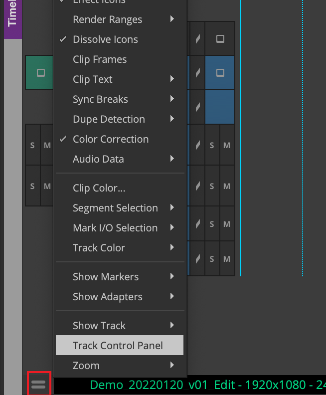
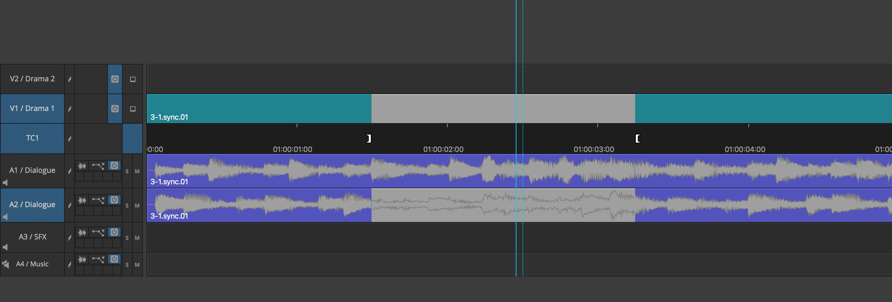

# 08 基础编辑技能之Source/Record Mode

## 源/录制模式

细心的读者会发现，几乎每个剪辑软件的剪辑面板都有两个窗口，一个显示源素材画面，另一个显示时间线画面。我们将显示源素材的窗口称为源监视器（Source Monitor）或预览监视器（Preview Monitor, PVM），将显示时间线的窗口称为录制监视器（Record Monitor）或节目监视器（Program Monitor, PGM）。剪辑就是将Source Monitor上的内容搬运到Record Monitor上的过程，我们称这种剪辑模式为**源录制模式（Source-Record Mode）**。

这种模式来源自磁带时期。如上图所示，源素材磁带放入源VCR（ Videocassette recorder)，要录制的磁带放入录制VCR，VCR输出的画面信号再进行分发，最后在监视器上显示。剪辑师可使用剪辑台远程控制VCR，根据监视器上的画面与信息进行剪辑，目标镜头将从源磁带转录到录制磁带。
而从磁带剪辑到今天的数字NLE，中间还有一段不短的历史，本篇教程暂不涉及，感兴趣的读者可以自行查阅相关资料。

## 时间线与轨道

### 创建时间线、轨道

在正式开始剪辑前，我们需要新建时间线，并且为时间线命好名。
新建时间线的操作如下。在Bin中空白处右键，选中New Sequence，或时间线面板中空白处右键，选中New>Sequence。

点击后，新的时间线将出现在当前Bin中。点击Name的文本，即可重命名。时间线命名一般只使用英文、数字、下划线和短横线，**要能够体现日期、版本、用途**。如：ABC_20220119_v01_Edit（ABC为项目名)

要新建视频轨道，则在时间线面板空白处右键，选中New>Video Track。新建音频轨道则New>Audio Track，并选择对应种类。

需要注意的是，**时间线上的轨道同样需要有良好的命名**。对轨道重命名的方法是，在目标轨道文字（V1、V2……)上右键，选中Rename Track，并在弹出窗口中输入轨道名称。

为方便后续演示，这里建立了一条具有V1、V2两条视频轨，A1、A2、A3、A4四条音轨的时间线，命名为Demo_20220120_v01_Edit，并对轨道命名。其中A1、A2、A3均为单声道，A4为立体声道。

### 轨道控制

在时间线面板左下角的快捷菜单中，可以调出轨道控制面板。

可以看到，完整的轨道控制面板中有许多按钮，下面依次讲解。

一条轨道（Track）可能会有几种状态，分别是**选中（Selected）、激活（Activated）、锁定（Locked）与解锁（Unlocked)**。

- Selected：选中与否，决定了该轨道**是否参与编辑**。非选中状态的轨道无法充当Source或Destination。
- Activated：激活与否，决定了该轨道上的内容**是否启用**。非激活状态的视频轨不输出画面，非Activated状态的音频轨不发声。
- Locked和Unlocked：锁定与否，决定了该轨道上的内容**是否可以被更改**。默认为Unlocked，即可以被更改。

在上图中：

- 位置1：轨道选择器中的V1被点亮，处于选中状态，V2处于非选中状态。点击轨道编号文字可切换选中与否。
- 位置2：点击按钮可以切换音频波形图的显示。
- 位置3：点击按钮可以切换关键帧的显示。
- 位置4：点击按钮切换轨道激活与否。

### 轨道监看/监听

#### 视频监看

与其他剪辑软件不同，Avid MC的视频轨道有一个特殊的**轨道监看按钮（Track Monitoring Button）**，即下图红框处的按钮。

轨道监看按钮决定了回放（Playback)时轨道上的内容是否可见。**在多轨编辑中，启用了轨道编辑按钮的轨道及其下方的轨道在回放是可见的。**

例如，时间线视频轨道有V1-V6共6轨，如果轨道监看按钮在V5启用，那么V1-V5轨都可见，而V6轨在回放时不起任何作用。如果我们需要在回放时预览全部轨道，则需要在最上层轨道启用轨道监看按钮。

#### 音频监听

Avid MC中监听音轨的方式与其他剪辑软件中是一样的，包含Mute（静音）和Solo（独奏）。

例如，时间线音频轨道有A1-A4共4轨。默认情况下，时间线上的所有激活的音轨都参与发声。如果将A3轨Mute掉，则A1、A2、A4都发声，A3轨不发声。如果将A1和A2轨Solo，则A1、A2轨单独发声，A3、A4自动被Mute掉不发声。

> 需要注意的是，监看/监听设置仅决定**回放时**看到、听到的内容。**轨道选中、激活与否**才真正决定最后输出的物料是否包含该轨道。

### 轨道映射

在构建时间线的过程中，常常要处理源素材的轨道如何对应到时间线上的问题，这就是**轨道映射**。
细心的学习者会发现，当我们加载有不同轨道的Clip到Source Monitor上时，时间线左边的轨道映射会有所变化。
比如，名为3-1的Subclip有V1、A1、A2三轨，其A1、A2均为单声道。将其加载到Source Monitor中时，可以看到，左下方的轨道映射如下图：

另一个名为3-2的Subclip有V1、A1两轨，其中A1为立体声，其轨道映射如下图：

**轨道映射决定了源素材的轨道如何对应到时间线上**。需要注意的一点是，**源轨道需要和时间线轨道类型对应**，才能添加到对应的时间线轨道上。如3-2的A1是立体声轨，就无法插入到时间线A1、A2的单声道轨道上。
改变轨道映射的方式很简单，只需要拖拽源轨道名称到对应的时间线轨道名称上。需要注意的是，只能在相同轨道类型之间重新指认。

## 构建与修改时间线

### Insert & Overwrite

三点编辑（Three-Point Editing）是最传统的构建时间线的方式。

三点，指的是**源素材的入点与出点**、**时间线上的入点与出点**这四个点的其中三个。打点指的是标记入点（Mark IN）与标记出点（Mark OUT）。三点编辑的基本模式是**插入（Insert）、覆盖（Overwrite）**。通过四个点中的三个，我们就能确定素材添加到时间线上的位置和方式。

> 在Avid MC中文版中，Overwrite被翻译为改写。
> 
> 如上图所示，剪辑师在源素材上打了入点与出点，在时间线上打了入点，选择插入模式。则源素材的入点与时间线上的入点对齐，源素材入出点之间的内容被插入到时间线上，插入点之后的内容自动后移而不被覆盖。
> 
> 如上图所示，剪辑师在源素材上打了入点和出点，在时间线上打了入点，选择覆盖模式。则源素材的入点与时间线上的入点对齐，时间线入点之后的部分内容被覆盖。

#### 操作

在Avid MC中，可以通过点击时间线上方工具栏中的图标来执行Insert和Overwrite命令。

其快捷键如下：

- I：打入点（Mark IN）
- O：打出点（Mark OUT）
- E：与I相同，打入点
- R：与O相同，打出点
- Q：播放头移动到入点（Go to In）
- W：播放头移动到出点（Go to Out）
- D：清除入点（Clear IN Mark）
- F：清除出点（Clear OUT Mark）
- G：同时清除入点出点（Clear Both Marks）
- V：插入（Insert）
- B：覆盖（Overwrite）
- A：上一事件（暂时可以理解为时间线上的Clip）
- S：下一事件

在Avid MC中，三点编辑的流程如下：

a. 在Bin中选取Subclip，双击将其加载到Source Monitor中。

b. 在Source Monitor中为Subclip打点，可选择使用快捷键，也可以使用Source Monitor下方的控件。
c. 在时间线上调节打点位置，可使用A、S移动播放头到不同剪辑点，也可以使用鼠标拖动播放头，到位之后打点。

d. 插入或覆盖以将素材添加到时间线上，可使用快捷键，也可以使用时间线上方的控件。

需要注意的是，如果当前时间线上没有Mark IN/OUT，则默认以播放头位置为Mark IN。

> #### 小技巧
> 
> - 按住Command/Ctrl在时间线上拖动鼠标，可将播放头吸附到剪辑点（Snap to Edit）。

### Lift & Extract

与三点编辑类似，提升（Lift）与提取（Extract）同样是通过打入出点的方式来指定目标范围。

> 在Avid MC中文版中，Lift被翻译为清除。
> 
> 如上图所示，剪辑师在时间线上打了入点和出点，Lift将目标范围之间的内容删除，并在目标范围留下一个空位；Extract同样将目标范围之间的内容删除，但会自动使用后续内容填充目标范围。

#### 操作

在Avid MC中，可以通过点击工具栏中的图标来执行Lift和Extract命令。

其快捷键如下：

- Z：Lift

- X：Extract

Lift和Extract的操作与三点编辑类似，都是**通过打点来指定范围**。其流程如下：

a. 在时间线为要删除的部分打入点和出点

b.选择需要被编辑的轨道

c. 通过快捷键或图标执行对应命令

需要注意的是，在Lift和Extract的操作中，轨道的状态依然起作用，未被选择的轨道无法被直接编辑。

（为什么说直接编辑呢？这是因为，就像其他许多剪辑软件一样，Avid MC有轨道同步锁的功能，在启用后，未被选择的轨道也可以被间接地编辑。后续文章会有对同步锁的介绍。）

### Copy, Cut & Paste

我们可以使用Avid MC中的Copy（拷贝）和Cut（剪切）功能来拷贝、剪切**时间线上的内容**，并Paste（粘贴）到新的位置。

Avid MC将被拷贝或剪切的内容当作一个暂时的Subclip，只不过这个Subclip并不会出现在Bin中，但依然可以充当Source。

剪辑师可以通过顶部菜单栏Tools>Clipboard Monitor来预览剪切板上的内容，Clipboard Monitor本质上也是一个Source Monitor。

需要注意的是，**被选中轨道上的内容**才会出现剪切板上。

#### 操作

a. 在时间线上为要拷贝或剪切的内容打上入出点

b. 使用快捷键或菜单进行拷贝或剪切

c. 以插入或覆盖的方式，完成粘贴操作

## 总结

我们使用源/录制模式进行编辑的时候，本质是处理**不同的轨道上入出点之间的内容**，**而非直接操作时间线上的Clip**，这与磁带编辑是一脉相承的。源/录制模式能够帮助我们快速完成粗剪，学习三点编辑也是剪辑师成长的必经之路。读者可以在Avid MC中多加练习。

读者也能够从本篇教程中发现，Avid MC中文版中的许多翻译容易引起歧义，因此，用英文原文来教学、讨论是更佳的选择。

接下来的教程将会讲解Segment Mode（片段模式）与Trim Mode（修整模式），前者直接操作时间线上的Clip，后者操作的是剪辑点。
