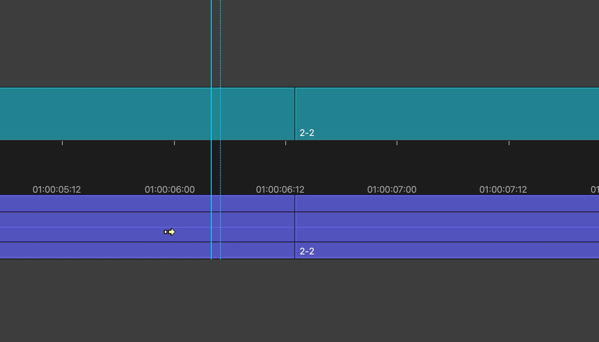
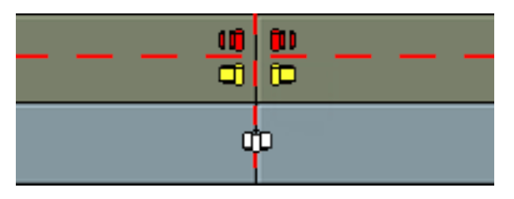
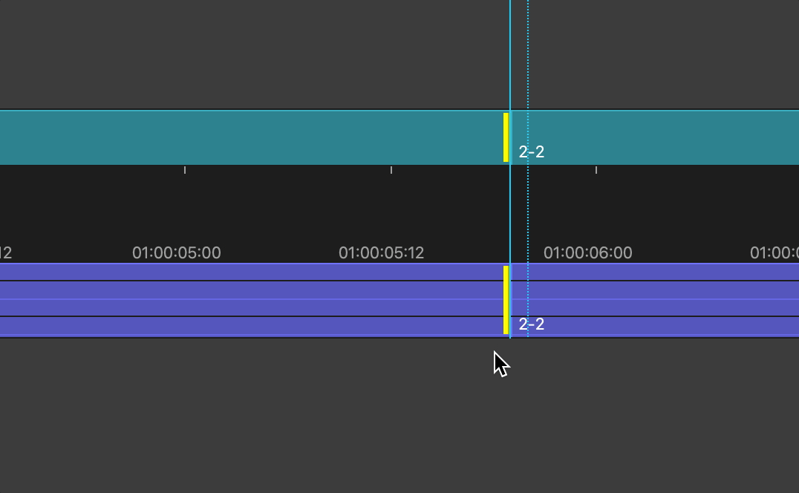

# 09 基础编辑技能之Trim Mode

在剪辑的过程中，我们往往需要对镜头之间的剪切点做精细调整。我们可以使用Avid MC中的Trim Mode（修剪模式）实现这一目的，且与打点编辑的方式相比更加高效。

## 命令面板和快捷键面板

在正式学习Trim Mode前，我们先了解一下Command Palette（命令面板）和Keyboard Palette（快捷键面板）的用法。

### Command Palette

我们可以在Command Palette（命令面板）中**集中地使用各种功能**，也可以使用它来将指派菜单与快捷键。
使用Command Palette的流程如下：

a. 点击顶部菜单栏中的Windows>Command Palette

b. 可以看到，Command Palette中有三种模式，分别是'Button' to 'Button' reassginment, Active Palette, 'Menu' to 'Button' Reassignment

它们的作用分别是：

- 'Button' to 'Button' reassginment：在按钮的槽位上替换已有按钮或是添加新的按钮。在此模式下，将Command Palette中的按钮拖拽到按钮槽位（如源监视器下方、时间线面板上的一排等）上，就可以添加按钮并通过点击按钮使用对应功能。
  
  
  
- Active Palette：直接点击Command Palette中的按钮即可使用对应功能。

- 'Menu' to 'Button' Reassignment：将菜单中的功能分配到按钮槽位或是快捷键上。在此模式下，先点击一个按钮槽位，后从菜单点击想要分配的功能，即可将该功能分配到该按钮槽位中。

  

我们可以在Command Palette中看到各种功能的图标及其对应文字描述，十分便利。

### Keyboard Palette

进入偏好设置中，切换到User设置面板，双击图示位置，进入Keyboard Palette。

我们可以在Keyboard Palette中看到当前所有快捷键。结合Command Palette的'Button' to 'Button'模式，我们也可以重新定义对应键位的功能。

读者可以关注图示位置的三个快捷键，它们从左到右分别是Trim Left(A Side)、Trim Both Sides(AB Sides)、Trim Right(B Side)。

Command Palette为我们提供了各种功能及图标的总览，Keyboard Palette为我们提供了快捷键的总览。学会使用这两者有助于我们快速上手Trim Mode。

## Trim Mode

### 进入Trim Mode

进入Trim Mode的方式有两种：

- 将播放头移动到剪切点附近，点击Trim Mode按钮，或是使用快捷键`U`。

- 在时间线上使用套索，框选中剪切点。

需要注意的是，处于**被选状态**轨道上的剪切点才能够在Trim Mode中被自动选中。进入Trim Mode后，剪切点默认会被标示成紫色的双竖线。

### 退出Trim Mode

退出Trim Mode的方式有许多种，下面列出两种：

- 进入其他模式即可自动退出Trim Mode。如，通过按钮或快捷键Y进入Source/Record Mode。
- 点击时间线上时间码轨道，或是其他空白处。

进入Trim Mode后，时间线面板中的许多东西需要我们留意，包括Trim Point、Trim Type、以及Trim Mode下的监视器。

### Trim Point

在Trim Mode下，片段与片段之间的剪切点就是一个个Trim Point。针对我们修剪方向的不同，Trim Point的标示也会有所不同。

> 在Avid MC中，如果要在一个片段中间切一刀，增加一个剪切点，可以使用时间线上方控件中的Add Edit。
> 
> 
> 
> 点击后即在当前播放头位置增加一个剪切点。
> 
> 如果剪切点两侧片段的帧是连续的，而我们不想要这个剪切点，可以使用顶部菜单栏中的Timeline>Remove Match Frame Edits，移除此剪切点。

### Trim Type

在时间线上方的工具栏中，有一个工具可以设定**启用的Trim Type**（修剪类型）。

- 黄色卷轴：进行Ripple Trim（波纹剪辑），改变片段长度时，其他片段会自动移动以适应。
- 红色卷轴：进行Overwrite Trim（覆盖剪辑），改变片段长度时，其他片段与当前片段重叠的部分会被覆盖。

除此以外，还有一种白色卷轴，进行Dual-roller Trim（双向剪辑），即Trim Point两侧的内容都会被修剪，片段自动移动以适应。

要想**在已启用的不同Trim Type之间切换**，我们需要用鼠标点击时间线上Trim Point的不同位置。不同Trim Type对应的位置即上图中的Trim Zone(可以先使用Command/Ctrl+L放大轨道，再进行操作)

### Trim Mode的监视器

进入Trim Mode后，Avid MC的监视器会显示当前修剪的内容，监视器下方的计数器显示当前修剪的帧数。

以单个Trim Point为例，左边的监视器显示Trim Point左侧镜头的尾帧，右边的监视器显示Trim Point右侧镜头的头帧。

当我们向左Trim Both Side 3帧，可以看到，左边计数器显示“-3”，右边计数器显示“-3”，说明Trim Point相对左侧镜头而言向左移动3帧，相对右侧镜头而言向左移动3帧（左为负方向，右为正方向)。

以两个Trim Point为例，四个监视器，依次显示第一个Trim Point左侧、第一个Trim Point右侧、第二个Trim Point左侧、第二个Trim Point右侧的帧。

此时的监视器下方的文字依然显示当前修剪的帧数。

### 通过拖拽进行Trim

进入Trim Mode后，播放头自动吸附到了最近的Trim Point上。将鼠标移动到Trim Point附近，调整得到所需的Trim Type，然后向目标方向拖拽，即可完成Trim的操作。

在拖拽时，监视器画面内容跟随当前Trim Point变化。调整完成后，按下空格键播放即可查看结果，也可在查看后继续调整。

### 通过快捷键进行Trim

通过键盘进行Trim需要使用到较多的快捷键。默认的Trim Type是波纹剪辑，需要使用鼠标来调整Trim Type。

**情景一**：假设需要上一镜的尾部少1帧，下一镜的头部多1帧，则两个镜头都需要被修剪，对应的是Trim Both Side（进入Trim Mode的默认选项，快捷键是左方括号`[`）。

**操作**：按下一次快捷键`,`（英文逗号）后，Trim Point随即向左移动1帧。

计数器显示当前镜头被修剪的帧数。同理可以用其他快捷键（`M`、`.`、 `/`)完成任意帧数的逐帧修剪。

按下空格播放，即可预览调整后的效果。

**情景二**：假设需要上一镜的尾部不变，下一镜的头部多2两帧，则只有Trim Point右边的镜头需要被修剪，对应的是Trim Right（快捷键是右方括号`]`）

**操作**：按下两次快捷键`.`（英文句号），Trim Point随即向右移动2帧。

**情景三**：假设需要做一个 J Cut，即下一镜的声音先于画面进入，则只有声音需要被修剪。需要注意的是，**处于被选状态的轨道才可以被Trim**。

**操作**：取消对视频轨道的选择，只选择音频轨道，此时调节Trim Point便只调节声音。

**情景四**：假设需要下一镜头部不动，上一镜尾部少8帧，中间使用黑场。则对应Trim Type应是覆盖剪辑。

**操作**：将鼠标移动到上一片段的尾部右上角并点击鼠标左键，Trim Point的竖线变为红色，表明当前Trim Type为覆盖剪辑。按下快捷键`M`，完成修剪。

在完成一个剪切点的调整后，我们可以使用快捷键A或S跳到其他剪切点继续调整。

在学习了两种拖拽和快捷键两种Trim的方式后，读者应该多多练习，做到熟练掌握Trim的操作，提高效率。

### 查看Trim结果

在使用Trim Mode修剪的过程中，按下空格键可以查看当前剪切点的结果。

默认情况下，按下空格键后只会播放一次。假设我们需要循环播放（Play Loop）当前剪切点的结果，可以中使用上文提到的Command Palette>Play中的Play Loop按钮。

细心的读者会发现，回放默认是从Trim Point前约两秒开始的，到剪切点后约两秒结束。剪切点前的时长叫做Preroll（预卷），剪切点后的时长叫做Postroll（续卷）。Preroll和Postroll的时长可以在偏好设置>User面板>Trim中指定。

### 多个Trim Point的调节

当需要同时调节多个Trim Point时，操作如下：

a. 进入Trim Mode。

b. 使用Shift+鼠标左键点击其他要调节的剪切点，注意Trim Type。

c. 使用鼠标或快捷键进行Trim。

同理，要调节不同的轨道上的剪切点，也可以使用Shift进行多选。

## 总结

Trim Mode是Avid MC中最重要的功能之一，能极大提升我们的剪辑效率。熟练掌握Trim Mode，需要读者的反复练习。
