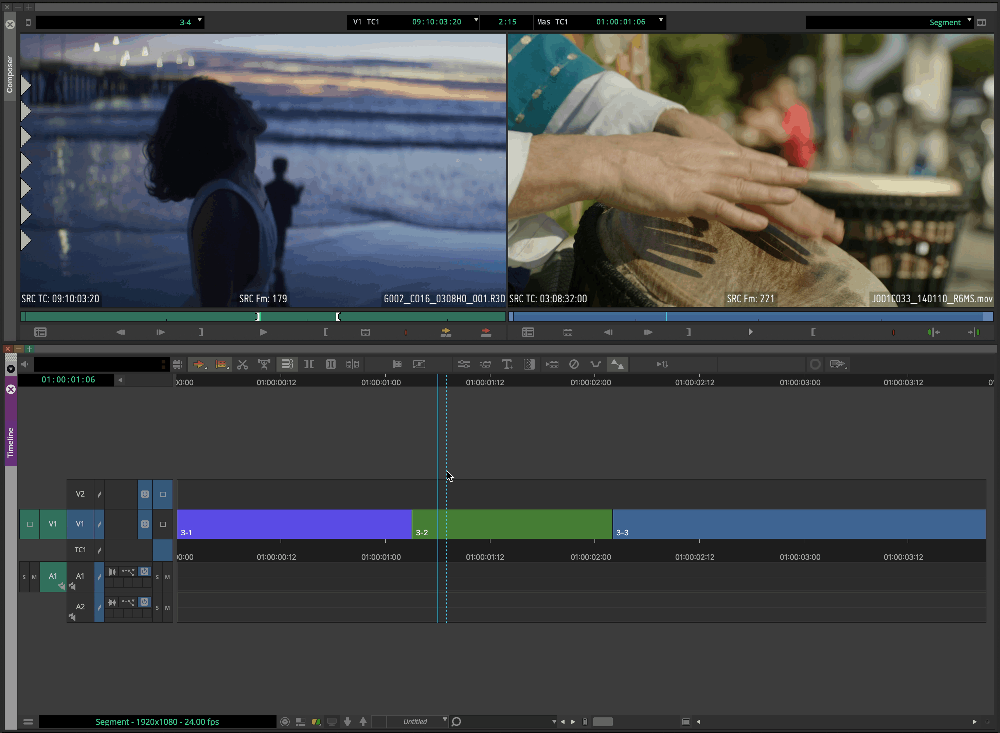
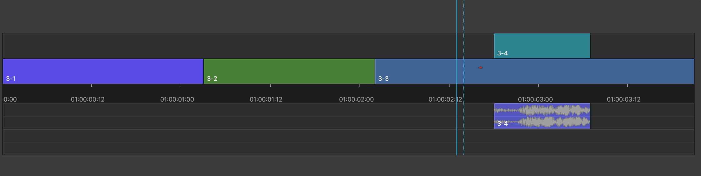

# 10 基础编辑技能之Segment Mode

在Avid MC中，时间线上一个个Master Clip、Subclip、Effect、Filler可统称为Segment（片段,中文版MC译为片断）。**Segment是时间线上两个剪切点之间的部分。**

和Source/Record Mode和Trim Mode不同，**在Segment Mode下，我们使用Segment Tool进行拖拽与放置（Drag and Drop）就能编辑时间线**，更加直观、方便，操作。

## Segment Tool的启用和切换

Segment Tool位于时间线上方的工具栏中，鼠标左键点击即可启用，右键改变可使用的Segment Tool的种类。不同的Segment Tool有不同的动作，红色箭头对应Lift/Overwrite，黄色箭头对应Extract/Splice-in。

> 在Avid MC中，Splice-in和Insert都指插入，是同义词。

Segment Tool的切换与Trim Type的切换类似。在Segment Tool启用后，将鼠标移动到时间线上Segment的不同位置即可切换。如下图所示，Segment的上半部分对应Lift/Overwrite，下半部分对应Extract/Splice-in。

## 编辑时间线上的片段

如下图所示，演示时间线上有V1、V2、A1、A2四条轨道，共有三个片段。

与三点编辑需要先打上IO点相似，使用片段编辑时需要先选中对应的片段。

**Overwrite**

假设需要将V2上的3-2 **Overwrite **到V1的3-1与3-3之间，操作如下：

a. 点击3-2并选中，鼠标移动到片段的上半部分切换成**红色箭头**。

b. 将3-2拖拽到3-1与3-3中间对应的位置上，完成操作。

**Splice-in(Insert)**

假设需要将V2上的3-2 **Insert** 到V1上3-1与3-3之间，操作如下：

a. 点击3-2并选中，鼠标移动到片段的下半部分切换成**黄色箭头**。

b. 将3-2拖拽到3-1与3-3中间对应的位置上，完成操作。

**Lift**

假设需要将V1上的3-2 **Lift** 到V2上，操作如下：

a. 点击3-2并选中，鼠标移动到片段的上半部分切换成**红色箭头**。

b. 将3-2拖到V2对应的位置上，完成操作。

**Extract**

假设需要将V1上的3-2 **Extract** 到V2上，操作如下：

a. 点击3-2并选中，鼠标移动到片段的下半部分切换成**黄色箭头**。

b. 将3-2拖到V2对应的位置上，完成操作。

> 使用Segment Tool编辑时间线上已有的内容时，Segment的移动不受轨道选择器或轨道激活与否的影响。

**使用键盘移动Segment**

选中Segment后，使用上`↑`/下`↓`箭头可在轨道间将其移动。需要注意的是，使用鼠标也可以上下移动Segment，但鼠标只处理当前所拖拽Segment的上下移动。

使用Trim Mode移动剪切点的四个快捷键（`,`、`.`、`M`、`/`）也可以前后移动Segment。

## 编辑Bin/源监视器上的片段

我们也可以从Bin或源监视器往时间线拖拽，执行上述的几种操作，此处不再赘述。

需要注意的是，从Bin/监视器往时间线拖拽时，使用的Segment Tool种类与当前启用的相关。

- 只启用一种：使用当前启用的Tool

- 同时启用两种/同时禁用两种：使用默认的Tool。更改默认的Segment Tool的设置，需要在时间线空白处右键菜单中选中Timeline Setting，在Edit选项卡中更改Defalut Segment Tool。

  

## 编辑多个Segment

上文的演示是简化的调整单个Segment的情况。在实际操作中，我们经常要同时操作多个Segment，一般包括两种情况：

- 操作合板产生的Subclip，包括视频Segment和音频Segment
- 操作时间线上的多个Clip

### Linked Clip

在时间线上方的工具栏中，有一个选项名为Linked Selection（链接片段）。

当此选项启用时，我们用Segment Tool选中单个Segment，与其链接的Segment也会被自动选中。此选项默认开启，可以让我们调节合板的Subclip时保持声画同步。

若此选项未开启，单独调整其中一个Segment时，链接片段之间失去同步。Segment下方会出现一个计数器，指示的当前的偏移帧数。

### 多选Segment

使用Shift+鼠标左键可以手动多选时间线上的Segment，并同步调整。

在实际剪辑过程中，我们还常常需要实现这些多选：

- 当前时间点之前（后）的所有片段
- 特定片段颜色的所有片段
- 时间线上的所有离线片段
- 反选当前选择的片段
- ……

Avid MC为我们提供了实现上述多选的方法。操作方法为：

a. 如果要进行基于时间点的选择，需要先将播放头移动到特定位置。

b. 在时间线右键，选择菜单中的Select，并选择Select子菜单中的对应选项。（此方法受轨道选择器影响）

其中，选择“当前时间点之前（后）的所有片段“的功能也出现在Command Palette中，可将其指定到时间线上方的工具栏中，方便操作。

## 总结

在学习了Source/Record Mode和Trim Mode之后，我们会发现Segment Mode的用处是独特的。

Segment Mode在我们要单独调整某个片段，或是当前调整只需要拖拽就能解决时，可以很快地实现我们想要的效果。但如果要让它替代另外两个模式，也许可以实现同等的效果，但效率会大大下降。

在未开启Segment Mode时，点击时间线上任意位置都可以移动播放头。开启Segment Mode之后，就有可能因为不小心拖拽到Segment，发生误操作。在任意模式下，点击时间码轨道的任意位置都可以移动播放头。

至此，Avid MC操作时间线的三种模式已经讲解完毕。读者可以自行查阅手册，进一步了解本专栏尚未涉及的细节。