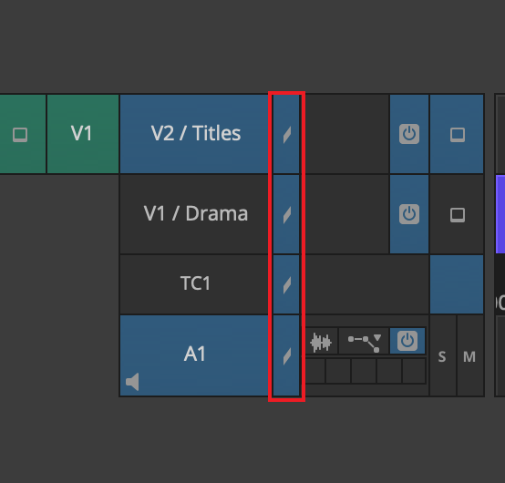
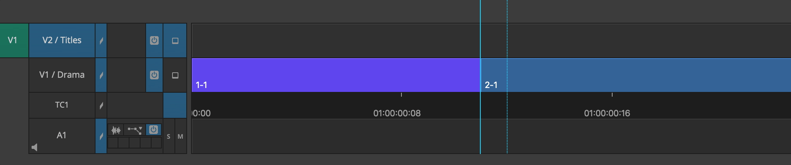
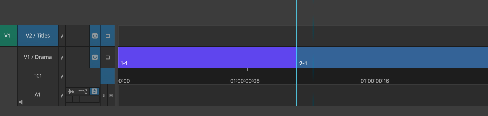
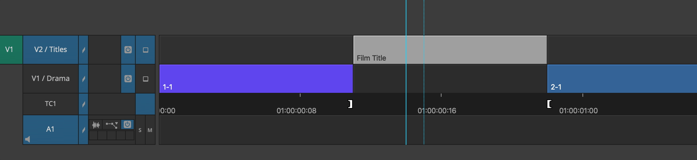
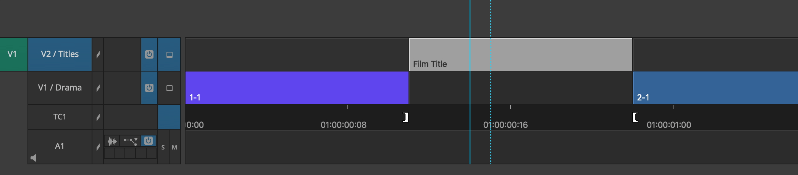
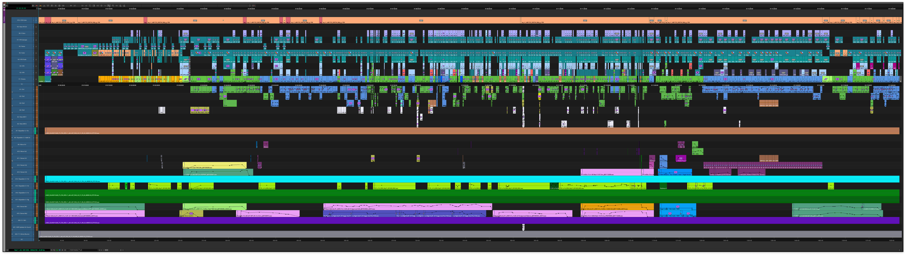
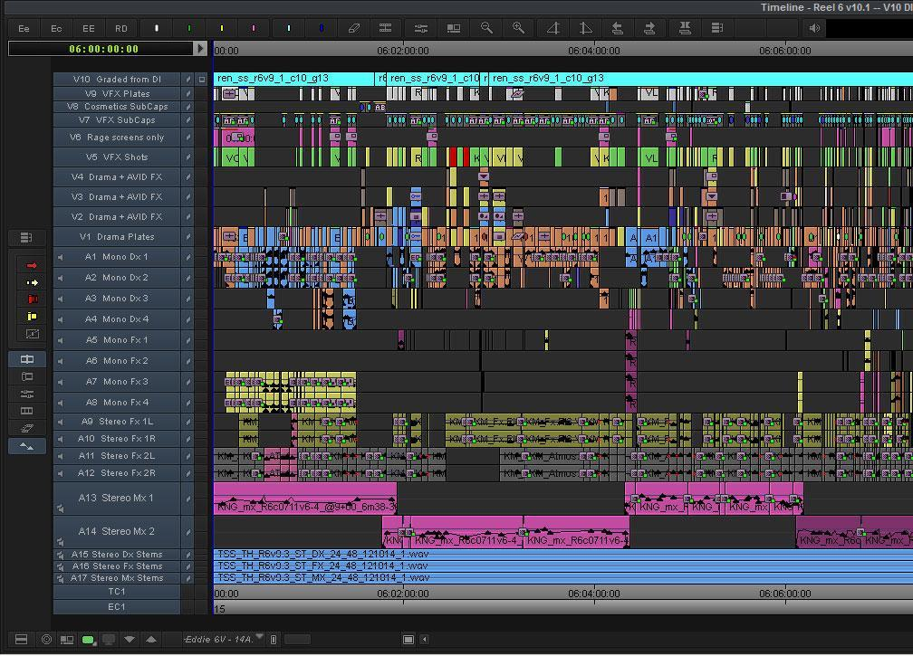
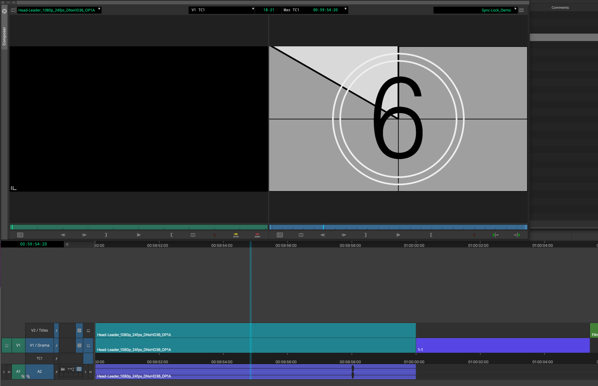
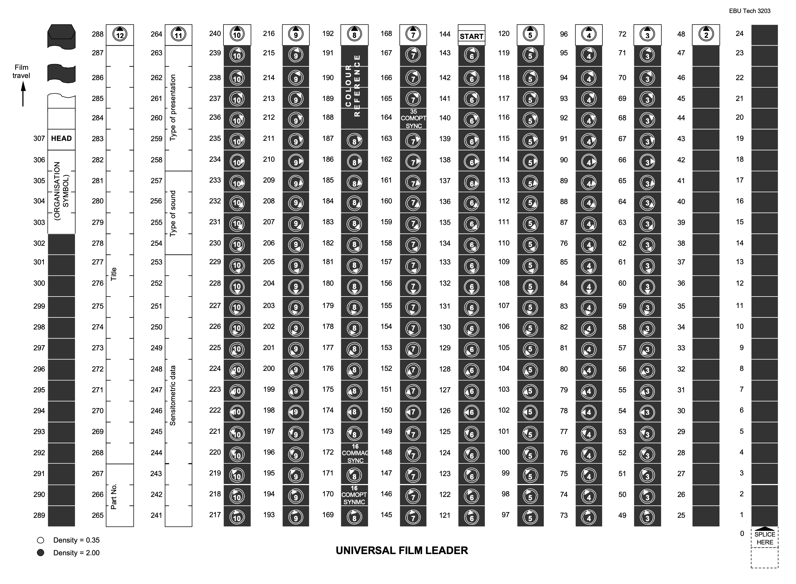

# 11 基础编辑技能之多轨编辑

在剪辑工作中，我们常需要进行多轨编辑，实现某些复杂的声画效果，或在特定轨道放特定类型的片段（画面如DI小样、视效小样、遮幅等，声音如对白、效果声、音乐等）。

## 多轨编辑的工具

多轨编辑的方式和单轨编辑基本相同，都可以采用三点编辑（Source/Record Mode）、拖拽编辑（Segment Mode）等方法。不同的是，多轨编辑需要考虑**不同轨道之间内容的同步**，避免破坏非目标轨道上的内容，造成错误覆盖或素材错位。

### 轨道同步

**轨道同步（Sync Lock，轨道同步）能够在我们编辑时间线时自动地保持各轨的同步**。当多个轨道启用轨道同步时，如果在其中一轨插入一个片段，软件会在其他轨上的对应位置添加Filler（中文版MC翻译为补白，意为填补空白），从而保持各轨道间的同步。

轨道同步的切换按钮位于Avid MC的时间线面板上。点亮为开启，反之为关闭。另外，点击TC轨道上的轨道同步按钮可批量切换所有轨道的轨道同步开关。

**例1** 如下图所示，当前时间线上有V1、V2、A1三轨，轨道选择器只选择了V2轨。

使用**三点编辑**法在V2**插入**一段素材，若轨道同步为开启状态，V1轨上的素材会自动后移，从而保持同步。

若轨道同步为关闭状态，在V2轨插入素材后，V1的内容保持不变。

**例2** 如下图所示，当前时间线上有V1、V2、A1三轨，轨道选择器只选择了V2轨。

使用**三点编辑**法在V1**提取（Extract）**一段素材，若轨道同步为开启状态，V1轨上的素材会自动前移，从而保持同步。

若轨道同步为关闭状态，在V2轨Extract素材后，V1的内容保持不变。

我们可以根据自己的需求来开关轨道同步。

> 也许有读者会产生这样一个疑问：为什么我们需要轨道同步？在轨道选择器上选中其他轨道的同样可以让我们插入一段“空”，从而同步。
>
> 当轨道数目较多时，频繁地开关轨道选择器会降低操作效率，并且可能失误覆盖其他轨道的内容。通过切换轨道同步开关，我们可以在只选中目标轨道的情况下进行编辑，根据需要保持同步。

## 轨道管理

在剪辑工作中，我们应当养成保持时间线整洁有序的习惯。一般来说，我们会为轨道命名，特定片段只放在特定轨道上，避免混杂。

读者有时会见到下图所示剪辑时间线，剪辑师并非使用十几轨素材叠加出最终画面，而是在这些轨道上管理特定的的片段。在后续交接中，剪辑部门将挑选下游部门需要的轨道进行物料输出。

从需求出发，我们需要在时间线上管理的片段一般有如下几类：

- 剪辑部门产生
  - 基础镜头，不添加任何效果
  - 简单效果镜头，在Avid MC内做了缩放、位移、旋转等简单调整
  - 变速镜头，在Avid MC内做了线性或非线性变速调整
  - 临时视效镜头，由剪辑完成以示意
  - VFX ID片段（一般是SubCap字幕），用于标记视效镜头号
  - 对白、声效、环境（可能添加简单效果）
  - 画面遮幅
  - 备注字幕
- 视效部门产生
  - 视效镜头小样
- DI部门产生
  - DI小样
- 声音部门产生
  - 人声轨
  - 音乐轨
  - 混录音轨
  

根据实际情况，剪辑师需要使用的片段可能与上述列出的有所不同。大家形成了一些基本的最佳实践，例如：

- 在Bin中或时间线上为不同用途的片段分配不同颜色

- 可考虑将带效果片段单独放一轨，如无效果的基础镜头放V1、缩放镜头放V2、变速镜头放V3

- 将新版本视效镜头放到单独一轨VFX Temp上，确认使用该版本后移到VFX Final轨

- 在各分本的画面头尾、时间线上视频、音频轨道放置Leader（牵引片），辅助标识、同步剪辑内容

> 什么是Leader？
>
> Film Leader源于胶片时代，意为“牵引片”，指的是一段连接在正式画面头部或尾部的胶片，能够辅助换片、过片，减少对正式画面的磨损。一卷胶片拷贝通常由片头牵引片（Head Leader，以下简称片头）、片尾牵引片（Tail/Foot Leader，以下简称片尾）和正式画面组成。片头和片尾没有与正式画面有关的画面，仅包含一些技术性的标记，用于辅助识别胶片并确保影片正常播放。
>
> 以EBU 3203标准规定的Universal Head Leader为例，该Leader由空白部分、识别部分和同步部分组成。识别部分可包括片名、时长、帧率、总卷数、卷编号等文字标记，同步部分包括指针数字倒计时、参考画面、声音同步标记等。Universal Leader倒计时中数字“2”的时长为一帧，伴有一同等时长的蜂鸣声，被称为“2-pop”，通过播放检查数字“2”的一帧与蜂鸣声是否同步出现，即可简单验证声画同步。
>
> 
>
> 在数字时代，Film Leader不再以物理胶片的形式存在，但其标识作用被时间线上的数字Leader文件所延续。剪辑师依然会在时间线的开头、结尾添加Leader，起到标识时间线的作用。在不同部门间交接时，Leader中与正式画面无关的内容可以作为通用的标记，正确统一物料的起止时间点。在制作母版时，“2-pop”标记经常用于快速对齐画面轨和声音轨。
>

在上述基础上，剪辑师应**根据项目要求确定工作规范**。维护整洁时间线的重要性不仅体现在**帮助剪辑师“可持续发展”**，也在于**为各部门交接提供引导和便利**。

## 参考资料

[1]Universal Film Leader for Cinema and Television[S/OL]. (1973-06-29)[2024-10-26]. https://tech.ebu.ch/publications/tech3203.

[2]中国电影发行放映公司电影放映技术教材编写组. 35毫米电影放映机[M]. 1965年9月第1版. 北京: 中国电影出版社, 1965.

[3] D-Cinema Distribution Master — Digital Leader[S/OL]. (2010-09-18). https://pub.smpte.org/pub/rp428-6/rp0428-6-2009.pdf

## 推荐阅读

https://jonnyelwyn.co.uk/film-and-video-editing/inside-professional-editing-timelines/

https://2pop.calarts.edu/technicalsupport/using-standard-leader/

https://mp.weixin.qq.com/s/GZL8GHsjhHfeWFn-B5ZnDg

